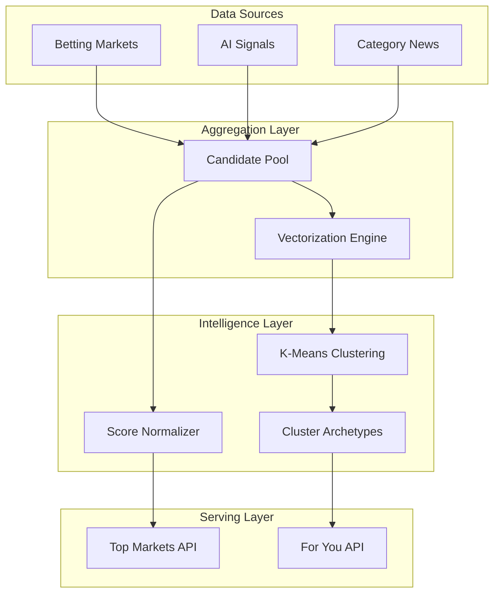

# AI Recommendation System Architecture

> **Technical Deep Dive: "For You" & "Top Markets" Engine**
>
> This document details the algorithmic approach, data aggregation strategies, and K-Means clustering logic powering the personalized recommendation engine in ExoDuZe.

---

## 1. System Overview

The Recommendation System (`RecommendationsService`) is a dedicated micro-service module designed to solve the "Discovery Problem" in prediction markets. It moves beyond static lists to provide:
1.  **Global Hotness**: A unified leaderboard of the most important content across *all* categories.
2.  **Personalization**: A "For You" feed tailored to user affinity using unsupervised learning (K-Means).

### Architecture



---

## 2. "Top Markets" Algorithm

The **Top Markets** feed provides a "Global Pulse" of the platform. It is NOT just a list of high-volume betting markets; it is a hybrid ranking of *actionable opportunities*.

### 2.1 Aggregation Strategy
The system pulls valid candidates from 3 distinct verticals in parallel:
1.  **Prediction Markets**: Active markets sorted by volume (`MarketsService.getFeatured`).
2.  **Market Signals**: High-strength AI alerts (`MarketDataService.getTopSignals`).
3.  **Category News**: Top news from all 8 categories (Politics, Economy, etc.).

### 2.2 Scoring Logic
Items are ranked by a normalized `HotnessScore` (0.0 - 1.0) using a multi-factor weighted algorithm:

```typescript
const TOP_MARKETS_WEIGHTS = {
    volume: 0.25,        // Trading volume (25%)
    impact: 0.20,        // Impact level (20%)
    signalStrength: 0.20,// AI Signal strength (20%)
    trendScore: 0.15,    // Trending topic boost (15%)
    freshness: 0.10,     // Time decay (10%)
    engagement: 0.10,    // User engagement (10%)
};
```

$$ Score = (Vol \cdot 0.25) + (Impact \cdot 0.20) + (Signal \cdot 0.20) + (Trend \cdot 0.15) + (Fresh \cdot 0.10) + (Engage \cdot 0.10) $$

*   **Markets**: Heavily weighted by liquidity/volume.
*   **Signals**: Directly weighted by their detected strength (e.g., "Critical" = 1.0).
*   **News**: Base score ensures visibility, boosted by "High Impact" flags.

---

## 3. "For You" Personalization (K-Means)

The **For You** engine uses **K-Means Clustering** to group content into distinct "Archetypes" and matches users to these clusters based on their interest vector.

### 3.1 Mutual Exclusion
To ensure diverse discovery, items appearing in "Top Markets" are significantly down-weighted or excluded from "For You" feeds. This prevents the "echo chamber" effect where users only see what's already popular.

### 3.2 Diversity Algorithm
Unlike standard K-Means, our implementation enforces a **Category Diversity Constraint**:
*   Max 4 items per category per feed.
*   Ensures a mix of Crypto, Politics, and Economy even if a user is solely focused on one vertical.

### 3.3 Vectorization
Every piece of content is converted into a multi-dimensional vector:
```json
{
  "crypto": 1.0,
  "economy": 0.0,
  "politics": 0.0,
  "impact": 0.8
}
```
*   **Dimensions**: `[politics, finance, tech, crypto, sports, economy, science, impact]`
*   **One-Hot Encoding**: Categories are binary flags (1.0).
*   **Impact Dimension**: Adds weight to high-importance items regardless of category.

### 3.4 Cluster Archetypes
The system automatically groups content into 5 primary clusters (Archetypes):
1.  **Crypto Whale**: High affinity for `crypto`, `tech`, and high `volume`.
2.  **Macro Analyst**: High affinity for `economy`, `politics`, and `finance`.
3.  **Tech Enthusiast**: High affinity for `tech`, `science`.
4.  **Sports Fan**: High affinity for `sports`.
5.  **General News**: High affinity for `impact` (balanced categories).

### 3.5 User Matching (Cold Start)
*   **Simulated History**: Currently, the system uses a 'Global Trend Vector' to seed new users.
*   **Matching**:
    1.  Calculate Cosine Similarity between User Vector and Cluster Centroids.
    2.  Select the **Best Matching Cluster**.
    3.  Serve top-ranked items from that cluster.
    4.  *Fallback*: If the cluster has insufficient items, backfill with high-score global items.

---

## 4. API Reference

### Get Top Markets
`GET /api/v1/recommendations/top-markets?limit=20&offset=0`

Returns a mixed list of Markets, Signals, and News, sorted by Hotness Score. Supports pagination.

### Get "For You"
`GET /api/v1/recommendations/for-you?userId={id}&limit=20&offset=0`

Returns personalized recommendations based on the user's computed cluster. Supports pagination.

---

## 5. Performance & Security
*   **Caching Strategy**: 1-minute TTL in-memory cache to prevent database throttling under high load.
*   **Rate Limiting**: Anti-throttling protection limits simple IP-based requests to 100/min.
*   **Input Sanitization**: Strict UUID validation and limit caps (max 100) to prevent abuse.
*   **Fail-Safe**: graceful degradation to "Latest" if recommendation engine fails.
