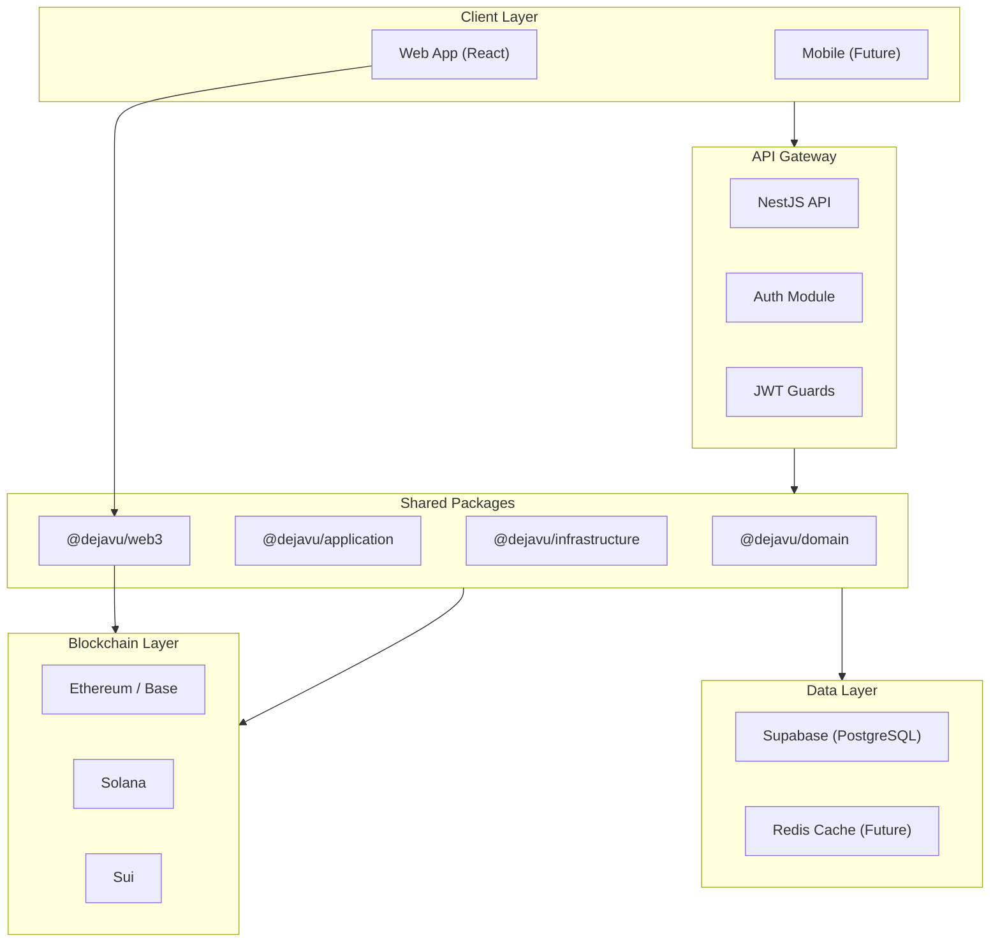
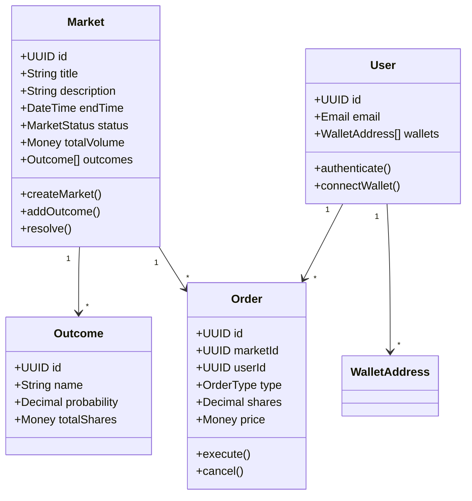
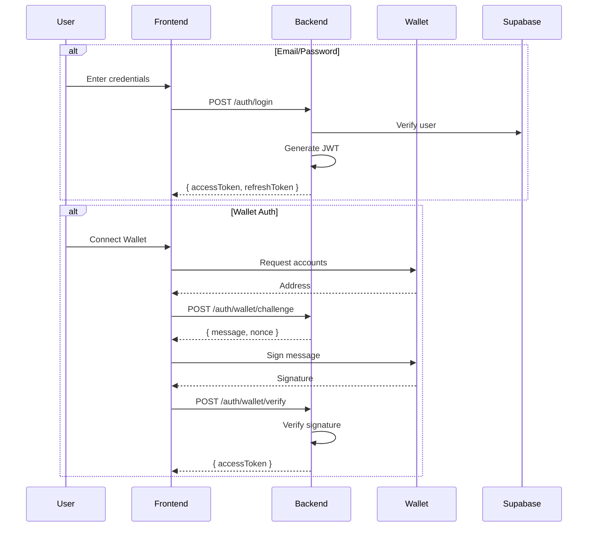
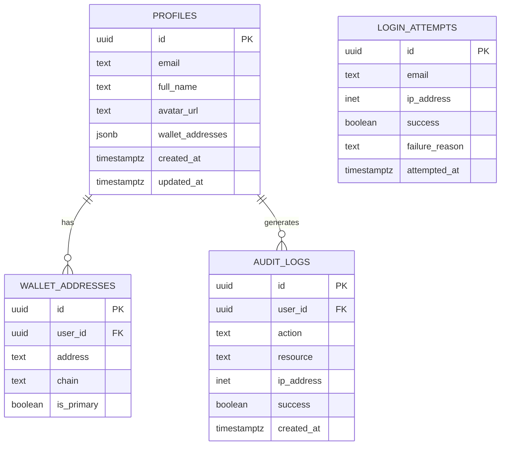
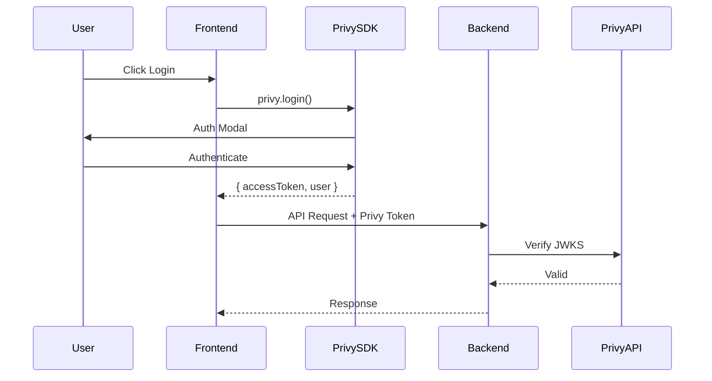
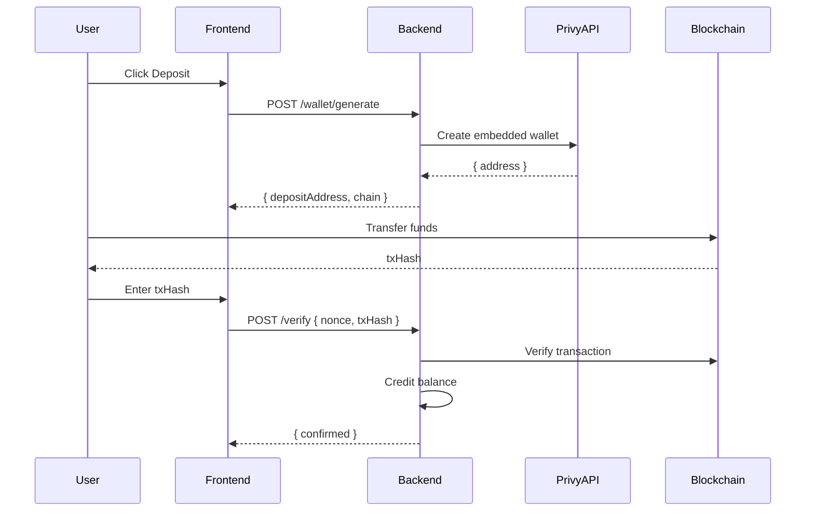

# DeJaVu — Enterprise Documentation

> **Decentralized Prediction Market Platform**  
> Version 1.1.0 | Last Updated: January 7, 2026

---

## Executive Summary

DeJaVu is an enterprise-grade decentralized prediction market platform designed for scalability, security, and multi-chain interoperability. Built on modern web technologies and blockchain infrastructure, it enables users to create, trade, and settle prediction markets across Ethereum, Solana, Sui, and Base networks.

### Core Value Propositions

| Capability | Description |
|------------|-------------|
| **Multi-Chain** | Native support for EVM, Solana, and Sui ecosystems |
| **Multi-Auth** | Email, OAuth, Magic Link, and wallet-based authentication |
| **Enterprise Security** | Rate limiting, brute force protection, audit logging, RLS |
| **Scalable Architecture** | Modular monorepo with clean architecture principles |

---

## Table of Contents

1. [System Architecture](#system-architecture)
2. [Technology Stack](#technology-stack)
3. [Project Structure](#project-structure)
4. [Applications](#applications)
5. [Shared Packages](#shared-packages)
6. [Smart Contracts](#smart-contracts)
7. [Domain Model](#domain-model)
8. [API Reference](#api-reference)
9. [Authentication & Security](#authentication--security)
10. [Database Design](#database-design)
11. [Development Guide](#development-guide)
12. [Deployment](#deployment)
13. [Roadmap](#roadmap)

---

## System Architecture



### Design Principles

1. **Clean Architecture** — Separation of concerns with dependency inversion
2. **Domain-Driven Design** — Rich domain models with aggregates and value objects
3. **Event-Driven** — Loosely coupled components via message bus
4. **Multi-Chain Native** — Abstracted wallet adapters for all supported chains
5. **Security First** — Defense in depth with multiple security layers

---

## Technology Stack

### Core Technologies

| Layer | Technology | Purpose |
|-------|------------|---------|
| **Frontend** | React 19, TypeScript, Vite | Modern SPA with fast builds |
| **Backend** | NestJS 10, TypeScript | Modular, scalable API server |
| **Database** | Supabase (PostgreSQL) | Managed database with RLS |
| **Auth** | Passport.js, JWT, Supabase Auth | Multi-strategy authentication |
| **Blockchain** | ethers.js, @solana/web3.js, @mysten/sui.js | Multi-chain interactions |

### Smart Contract Frameworks

| Chain | Framework | Language |
|-------|-----------|----------|
| EVM (Ethereum, Base) | Foundry | Solidity 0.8.23 |
| Solana | Anchor | Rust |
| Sui | Move CLI | Move |

### Development Tools

| Tool | Purpose |
|------|---------|
| **Turborepo** | Monorepo build orchestration |
| **PNPM** | Fast, efficient package management |
| **TypeScript** | Type-safe development |
| **Prettier** | Code formatting |

---

## Project Structure

```
dejavu/
├── apps/                           # Application packages
│   ├── api/                        # NestJS Backend API
│   ├── web/                        # React Frontend
│   └── www/                        # Marketing site (future)
│
├── packages/                       # Shared packages
│   ├── domain/                     # DDD: Entities, Value Objects, Aggregates
│   ├── application/                # Use cases and application services
│   ├── infrastructure/             # Repository implementations, DB
│   ├── shared/                     # Common utilities and types
│   ├── web3/                       # Multi-chain wallet adapters
│   ├── messaging/                  # Event-driven message bus
│   ├── caching/                    # Cache abstraction layer
│   ├── events/                     # Domain and integration events
│   ├── config/                     # Shared configuration
│   ├── contracts/                  # Contract ABIs and types
│   ├── core/                       # Core utilities
│   ├── testing/                    # Test utilities and fixtures
│   └── ui/                         # Shared UI components
│
├── contracts/                      # Smart contracts
│   ├── evm/                        # Solidity (Foundry)
│   ├── solana/                     # Anchor programs
│   └── sui/                        # Move modules
│
└── documentation/                  # Project documentation
```

---

## Applications

### Frontend — `apps/web`

The web application is a React 19 SPA built with Vite for optimal performance.

**Key Features:**
- Server-side rendering ready
- Theme system (light/dark/system)
- Responsive design
- Web3 wallet integration

**Architecture:**
```
apps/web/src/
├── app/
│   ├── components/         # UI components (auth, dashboard, markets, layout)
│   ├── hooks/              # Custom React hooks (useAuth, useWallet, useTheme)
│   └── utils/              # Helper functions
├── services/               # API clients and external services
└── styles/                 # Global CSS and theme variables
```

### Backend API — `apps/api`

Enterprise-grade NestJS application following clean architecture.

**Key Features:**
- Modular architecture with feature modules
- JWT-based authentication with refresh tokens
- Rate limiting and brute force protection
- Comprehensive audit logging
- Swagger API documentation

**Module Structure:**
```
apps/api/src/
├── modules/
│   ├── auth/               # Authentication (multi-strategy)
│   ├── users/              # User management
│   ├── markets/            # Prediction markets CRUD
│   ├── orders/             # Order management
│   └── dashboard/          # Dashboard aggregations
├── common/                 # Middleware, filters, interceptors
├── config/                 # Environment validation
└── database/               # Supabase service and migrations
```

---

## Shared Packages

### `@dejavu/domain`

Core domain layer implementing DDD patterns.

**Structure:**
- **Common** — Base entity, aggregate root, value object, domain events
- **Market** — Market aggregate, outcomes, pricing models
- **User** — User aggregate, wallet addresses, preferences
- **Order** — Order entity, trade history

**Key Abstractions:**
```typescript
// Aggregate Root pattern
abstract class AggregateRoot<TId> {
  protected readonly _domainEvents: DomainEvent[] = [];
  addDomainEvent(event: DomainEvent): void;
  clearDomainEvents(): DomainEvent[];
}

// Value Object pattern  
abstract class ValueObject<T> {
  abstract equals(vo?: ValueObject<T>): boolean;
}
```

### `@dejavu/application`

Application services orchestrating domain operations.

- Use case implementations
- Command and query handlers
- Application services

### `@dejavu/infrastructure`

Infrastructure implementations and integrations.

- Repository implementations
- Database utilities (Supabase client)
- External service adapters

### `@dejavu/web3`

Multi-chain wallet abstraction layer.

**Supported Chains:**
- Ethereum (MetaMask, WalletConnect)
- Solana (Phantom, Solflare)
- Sui (Sui Wallet)
- Base (Coinbase Wallet)

**Usage:**
```typescript
import { useWallet } from '@dejavu/web3';

const { connect, disconnect, address, chain, isConnected } = useWallet();
await connect('ethereum');
```

### `@dejavu/messaging`

Event-driven communication infrastructure.

- Message bus for inter-module communication
- Domain event publishing
- Integration events for external systems

---

## Smart Contracts

### EVM Contracts — `contracts/evm`

Solidity contracts for Ethereum-compatible chains.

**PredictionMarket.sol** — Core market contract

| Function | Access | Description |
|----------|--------|-------------|
| `createMarket()` | Public | Create a new prediction market |
| `buyShares()` | Public | Purchase outcome shares |
| `getMarket()` | View | Retrieve market details |
| `getOutcomes()` | View | Get market outcomes |
| `setOracle()` | Owner | Configure oracle address |
| `setPlatformFee()` | Owner | Set platform fee (max 10%) |

**Market States:**
```
Active → Closed → Resolved → (Disputed)
```

**Development:**
```bash
cd contracts/evm
forge build      # Compile contracts
forge test       # Run tests
forge script script/Deploy.s.sol --rpc-url $RPC --broadcast
```

### Solana Contracts — `contracts/solana`

Anchor programs for Solana blockchain.

**Program Instructions:**

| Instruction | Description |
|-------------|-------------|
| `create_market` | Initialize new prediction market |
| `buy_shares` | Purchase shares for an outcome |
| `resolve_market` | Settle market with winning outcome |

**Account Structure:**
```rust
pub struct Market {
    pub authority: Pubkey,
    pub title: String,
    pub description: String,
    pub status: MarketStatus,
    pub outcome_count: u8,
    pub winning_outcome: Option<u8>,
    // ... additional fields
}
```

**Development:**
```bash
cd contracts/solana
anchor build     # Compile programs
anchor test      # Run tests
anchor deploy    # Deploy to network
```

### Sui Contracts — `contracts/sui`

Move modules for Sui blockchain.

```bash
cd contracts/sui
sui move build   # Compile modules
sui move test    # Run tests
```

---

## Domain Model



---

## API Reference

### Authentication Endpoints

| Method | Endpoint | Auth | Description |
|--------|----------|------|-------------|
| POST | `/auth/signup` | Public | Register new user |
| POST | `/auth/login` | Public | Email/password login |
| POST | `/auth/magic-link` | Public | Send magic link email |
| POST | `/auth/wallet/challenge` | Public | Get signing challenge |
| POST | `/auth/wallet/verify` | Public | Verify wallet signature |
| GET | `/auth/google` | Public | Initiate Google OAuth |
| POST | `/auth/refresh` | Public | Refresh access token |
| POST | `/auth/logout` | JWT | Logout user |
| GET | `/auth/me` | JWT | Get current user |

### Market Endpoints

| Method | Endpoint | Auth | Description |
|--------|----------|------|-------------|
| GET | `/markets` | Public | List all markets |
| GET | `/markets/:id` | Public | Get market details |
| POST | `/markets` | JWT | Create new market |
| PUT | `/markets/:id` | JWT | Update market |
| DELETE | `/markets/:id` | JWT | Delete market |

### Order Endpoints

| Method | Endpoint | Auth | Description |
|--------|----------|------|-------------|
| POST | `/orders` | JWT | Place new order |
| GET | `/orders` | JWT | List user orders |
| GET | `/orders/:id` | JWT | Get order details |
| DELETE | `/orders/:id` | JWT | Cancel order |

---

## Authentication & Security

### Authentication Flows



### Security Layers

| Layer | Implementation |
|-------|----------------|
| **Input Validation** | class-validator decorators on all DTOs |
| **Rate Limiting** | 100 req/min general, 5 req/min auth |
| **Brute Force Protection** | Account lockout after 5 failed attempts |
| **Data Masking** | Passwords/tokens redacted in logs |
| **CORS** | Strict origin whitelist |
| **Security Headers** | Helmet.js configuration |
| **HTTPS** | Secure cookies in production |

### Production Checklist

- [ ] `NODE_ENV=production`
- [ ] `COOKIE_SECURE=true`
- [ ] `COOKIE_SAME_SITE=strict`
- [ ] Strong, unique JWT secrets (256-bit minimum)
- [ ] Database SSL connections enabled
- [ ] CORS limited to production domains
- [ ] Rate limiting configured appropriately
- [ ] Logging level set to `info` or `warn`

---

## Database Design

### Core Schema



### Row Level Security (RLS)

All tables implement RLS policies:

```sql
-- Users can only read their own profile
CREATE POLICY "Users can read own profile"
    ON public.profiles FOR SELECT
    USING (auth.uid() = id);

-- Service role bypasses RLS for admin operations
CREATE POLICY "Service role can manage all"
    ON public.profiles FOR ALL
    USING (auth.role() = 'service_role');
```

---

## Development Guide

### Prerequisites

- Node.js ≥ 20
- PNPM ≥ 9.0
- Git
- (Optional) Foundry, Anchor CLI, Sui CLI for contracts

### Initial Setup

```bash
# Clone repository
git clone https://github.com/siabang35/dejavu.git
cd dejavu

# Install dependencies
pnpm install

# Configure environment
cp apps/api/.env.template apps/api/.env
cp apps/web/.env.template apps/web/.env

# Edit .env files with your credentials

# Start development
pnpm dev
```

### Common Commands

| Command | Description |
|---------|-------------|
| `pnpm dev` | Start all apps in development |
| `pnpm build` | Build all packages |
| `pnpm typecheck` | TypeScript validation |
| `pnpm lint` | Lint all packages |
| `pnpm test` | Run test suites |
| `pnpm clean` | Clean build artifacts |

### Git Workflow

1. Create feature branch: `git checkout -b feature/your-feature`
2. Commit with conventional commits
3. Push and create Pull Request
4. Merge after review

**Commit Format:**
```
feat(auth): add wallet authentication
fix(ui): correct mobile navigation
docs: update API documentation
refactor(api): improve error handling
```

---

## Deployment

### Backend Deployment

**Recommended Platforms:** Railway, Render, Fly.io, AWS ECS

```bash
cd apps/api
npm run build
NODE_ENV=production npm start
```

### Frontend Deployment (Vercel)

**Recommended Platform:** Vercel (optimized for monorepo)

The project includes a `vercel.json` configuration for seamless deployment:

```json
{
  "buildCommand": "cd apps/web && pnpm install && pnpm build",
  "outputDirectory": "apps/web/dist",
  "rewrites": [
    { "source": "/(.*)", "destination": "/index.html" }
  ],
  "headers": [
    {
      "source": "/(.*)",
      "headers": [
        { "key": "X-Content-Type-Options", "value": "nosniff" },
        { "key": "X-Frame-Options", "value": "DENY" },
        { "key": "X-XSS-Protection", "value": "1; mode=block" },
        { "key": "Referrer-Policy", "value": "strict-origin-when-cross-origin" }
      ]
    },
    {
      "source": "/assets/(.*)",
      "headers": [
        { "key": "Cache-Control", "value": "public, max-age=31536000, immutable" }
      ]
    }
  ]
}
```

**Deployment Steps:**
1. Connect GitHub repository to Vercel
2. Vercel auto-detects monorepo structure
3. Build command executes `cd apps/web && pnpm install && pnpm build`
4. Output served from `apps/web/dist`

**Security Headers Included:**
- X-Content-Type-Options: nosniff
- X-Frame-Options: DENY (clickjacking protection)
- X-XSS-Protection: enabled
- Referrer-Policy: strict-origin-when-cross-origin

**Asset Caching:**
- Static assets cached with `immutable` for 1 year
- Optimal performance for production

```bash
# Local build verification
cd apps/web
pnpm build
# Output in dist/ directory
```

### Environment Variables

| Variable | Required | Secret | Description |
|----------|----------|--------|-------------|
| `SUPABASE_URL` | ✅ | ❌ | Supabase project URL |
| `SUPABASE_ANON_KEY` | ✅ | ❌ | Public API key |
| `SUPABASE_SERVICE_ROLE_KEY` | ✅ | ✅ | Admin API key |
| `DATABASE_URL` | ✅ | ✅ | PostgreSQL connection string |
| `JWT_SECRET` | ✅ | ✅ | Token signing secret |
| `JWT_REFRESH_SECRET` | ✅ | ✅ | Refresh token secret |
| `GOOGLE_CLIENT_ID` | ⚪ | ❌ | OAuth client ID |
| `GOOGLE_CLIENT_SECRET` | ⚪ | ✅ | OAuth client secret |
| `PRIVY_APP_ID` | ✅ | ✅ | Privy application ID |
| `PRIVY_APP_SECRET` | ✅ | ✅ | Privy API secret |

---

## Privy Integration

DeJaVu integrates with [Privy](https://privy.io) for embedded wallet creation and authentication.

### Configuration

```bash
# Backend .env
PRIVY_APP_ID=cmk2rk1w400bqju0c8tvu4fq4
PRIVY_APP_SECRET=your_secret_here
PRIVY_JWKS_URL=https://auth.privy.io/api/v1/apps/{app_id}/jwks.json
```

### Privy Service Features

| Feature | Description |
|---------|-------------|
| **JWKS Verification** | RS256 JWT validation with cached key rotation |
| **Embedded Wallets** | Auto-generate wallets per user per chain |
| **Token Validation** | Issuer, audience, and expiration checks |

### Privy Authentication Flow



---

## Deposit System

### Overview

The deposit system enables users to fund their accounts via blockchain transfers with Privy-generated wallet addresses.

### Deposit Endpoints

| Method | Endpoint | Auth | Description |
|--------|----------|------|-------------|
| GET | `/deposits/balance` | JWT | Get user balance |
| POST | `/deposits/wallet/generate` | JWT | Generate Privy wallet |
| GET | `/deposits/wallet/:chain` | JWT | Get wallet for chain |
| POST | `/deposits/initiate` | JWT | Initiate deposit |
| POST | `/deposits/verify` | JWT | Verify transaction |
| GET | `/deposits/history` | JWT | Get deposit history |

### Deposit Flow



### Security Features

| Feature | Implementation |
|---------|----------------|
| **Nonce Protection** | Time-limited nonces (5 min) prevent replay |
| **Amount Bounds** | Min $1, Max $100,000 per transaction |
| **Atomic Updates** | Database functions for balance operations |
| **RLS Policies** | Users can only see their own data |

---

## Database Migrations

### Migration Files

Located in `apps/api/supabase/migrations/`:

| File | Tables |
|------|--------|
| `000_foundation.sql` | profiles, wallet_addresses, login_attempts, audit_logs, user_sessions |
| `001_initial_schema.sql` | markets, positions, orders, liquidity_positions, security_events |
| `002_deposits.sql` | user_balances, privy_wallets, deposit_transactions, withdrawal_transactions |

### Key Tables Added

**privy_wallets**
```sql
CREATE TABLE privy_wallets (
    id UUID PRIMARY KEY,
    user_id UUID REFERENCES profiles(id),
    privy_user_id TEXT NOT NULL,
    wallet_address TEXT NOT NULL,
    chain TEXT NOT NULL,
    wallet_type TEXT DEFAULT 'embedded',
    is_active BOOLEAN DEFAULT true,
    UNIQUE(user_id, chain)
);
```

**user_balances**
```sql
CREATE TABLE user_balances (
    id UUID PRIMARY KEY,
    user_id UUID REFERENCES auth.users(id),
    currency TEXT DEFAULT 'USDC',
    balance DECIMAL(20,8) NOT NULL DEFAULT 0,
    locked_balance DECIMAL(20,8) NOT NULL DEFAULT 0,
    UNIQUE(user_id, currency),
    CONSTRAINT balance_gte_locked CHECK (balance >= locked_balance)
);
```

---

## Roadmap

### Phase 1 — Foundation ✅
- [x] Monorepo architecture setup
- [x] Frontend application (React)
- [x] Backend API (NestJS)
- [x] Multi-auth implementation
- [x] Database schema with RLS

### Phase 2 — Privy & Deposits ✅
- [x] Privy integration (JWKS, embedded wallets)
- [x] Deposit module (initiate, verify, history)
- [x] Balance management
- [x] Comprehensive migrations

### Phase 3 — Smart Contracts 🔄
- [x] EVM contract scaffolding
- [x] Solana program scaffolding
- [ ] AMM implementation (LMSR)
- [ ] Contract testing and audits
- [ ] Mainnet deployment

### Phase 4 — UI/UX Enhancements ✅
- [x] Responsive mobile sidebar
- [x] Deposit button integration with context
- [x] Theme-safe logout button styling
- [x] Mobile navigation improvements
- [x] Professional hover animations

### Phase 5 — Platform Features
- [ ] Market creation wizard
- [ ] Order book implementation
- [ ] Portfolio tracking
- [ ] Withdrawal system
- [ ] Notifications system

### Phase 6 — Scale & Growth
- [ ] Mobile application
- [ ] Additional chain support
- [ ] DAO governance
- [ ] Analytics dashboard

---

## Support & Resources

| Resource | Location |
|----------|----------|
| Technical Documentation | This document |
| Guidelines | [Guidelines.md](./Guidelines.md) |
| API Docs | `http://localhost:3001/api/docs` |
| Issues | GitHub Issues |

---

<div align="center">

**DeJaVu Platform** — *Predict the Future, Decentralized*

Built with enterprise-grade quality for scalability and security.

</div>

