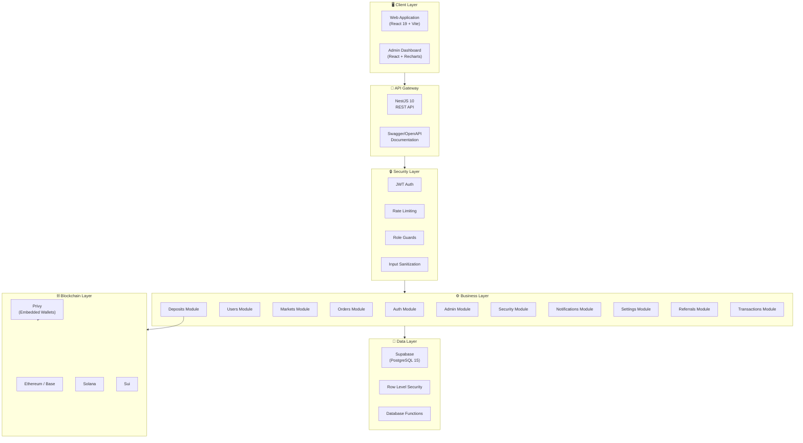
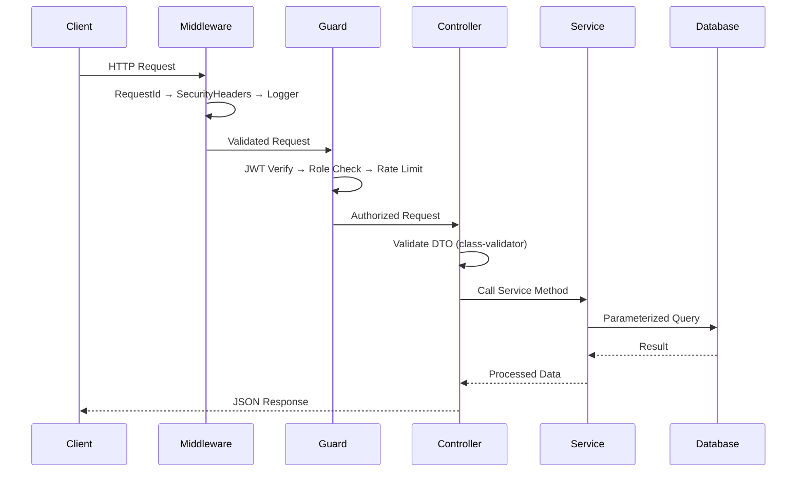
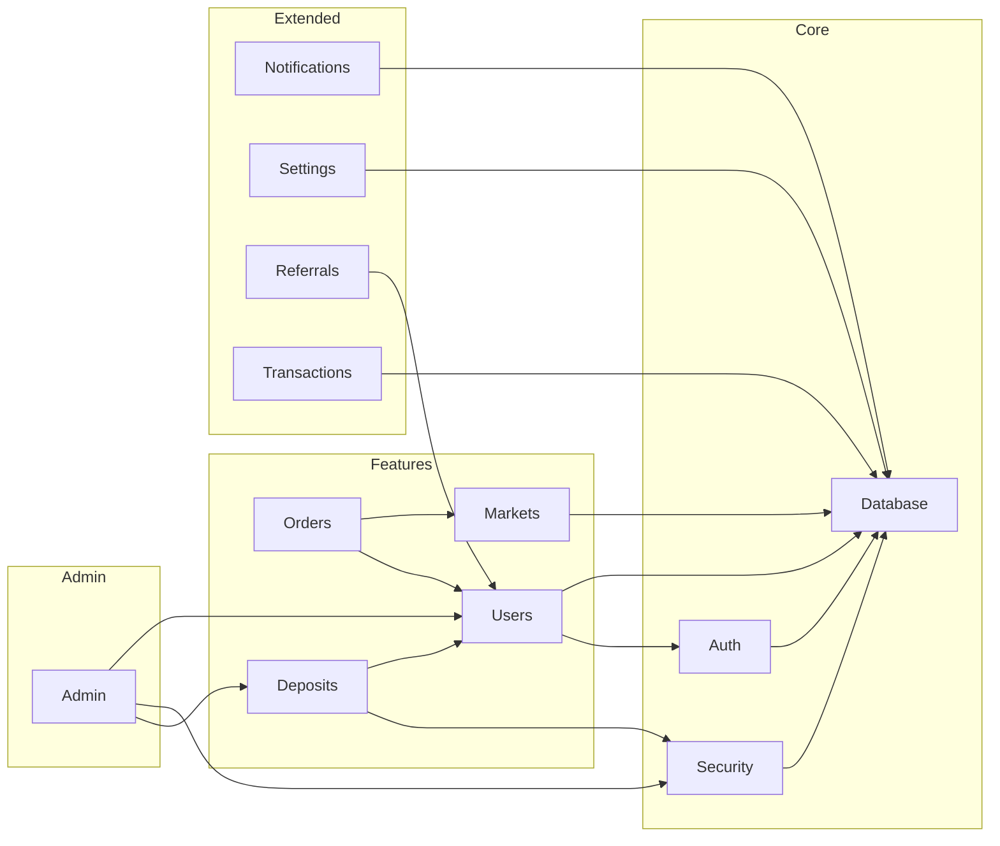
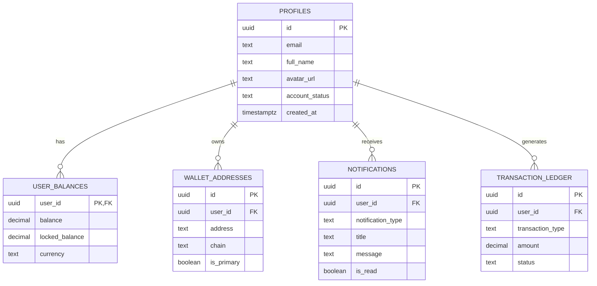
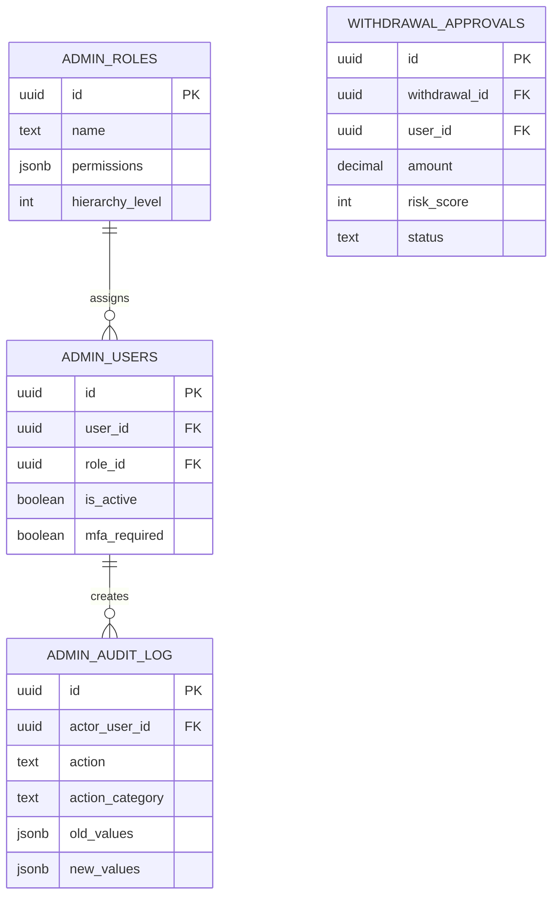

# DeJaVu — Enterprise Technical Documentation

> **Decentralized Prediction Market Platform**  
> Version 2.0.0 | Published: January 8, 2026  
> Classification: Internal Engineering Reference

---

## Document Information

| Attribute | Value |
|-----------|-------|
| **Document Type** | Technical Architecture Blueprint |
| **Target Audience** | Engineers, Architects, DevOps |
| **Confidentiality** | Internal Use |
| **Maintainer** | DeJaVu Engineering Team |

---

## Table of Contents

1. [Executive Summary](#1-executive-summary)
2. [System Architecture](#2-system-architecture)
3. [Technology Stack](#3-technology-stack)
4. [Real-Time Data Architecture](#4-real-time-data-architecture)
5. [Project Structure](#5-project-structure)
6. [Frontend Architecture](#6-frontend-architecture)
7. [Backend Architecture](#7-backend-architecture)
8. [Database Architecture](#8-database-architecture)
9. [Security Architecture](#9-security-architecture)
10. [Smart Contracts](#10-smart-contracts)
11. [Shared Packages](#11-shared-packages)
12. [API Reference](#12-api-reference)
13. [Deployment Architecture](#13-deployment-architecture)
14. [Appendix](#14-appendix)

---

## 1. Executive Summary

### 1.1 Platform Overview

DeJaVu is an enterprise-grade decentralized prediction market platform enabling users to create, trade, and settle prediction markets across multiple blockchain networks. The platform follows clean architecture principles with emphasis on security, scalability, and developer experience.

### 1.2 Key Capabilities

| Capability | Implementation |
|------------|----------------|
| **Multi-Chain Support** | Ethereum, Solana, Sui, Base via abstracted adapters |
| **Multi-Auth** | Email, OAuth, Magic Link, Privy, Wallet (MetaMask, Phantom) |
| **Enterprise Security** | OWASP Top 10 compliance, rate limiting, RLS |
| **Admin Dashboard** | Real-time monitoring, RBAC, audit logging |
| **Non-Custodial** | User-signed transactions, multisig support |

### 1.3 Architecture Highlights

- **Monorepo Structure**: Turborepo + PNPM workspaces
- **Backend**: NestJS 10 with 12 feature modules
- **Frontend**: React 19 with 85+ components
- **Database**: PostgreSQL 15 via Supabase with RLS
- **10 SQL Migrations**: 30+ tables, 40+ functions

---

## 2. System Architecture

### 2.1 High-Level Architecture


```mermaid
flowchart TB
    subgraph ClientLayer["🖥️ Client Layer"]
        WebApp["Web Application<br/>(React 19 + Vite)"]
        AdminUI["Admin Dashboard<br/>(React + Recharts)"]
    end

    subgraph APIGateway["🔌 API Gateway"]
        NestJS["NestJS 10<br/>REST API"]
        Swagger["Swagger/OpenAPI<br/>Documentation"]
    end

    subgraph SecurityLayer["🔒 Security Layer"]
        JWT["JWT Auth"]
        RateLimit["Rate Limiting"]
        Guards["Role Guards"]
        Sanitizer["Input Sanitization"]
    end

    subgraph BusinessLayer["⚙️ Business Layer"]
        AuthMod["Auth Module"]
        UserMod["Users Module"]
        MarketMod["Markets Module"]
        OrderMod["Orders Module"]
        DepositMod["Deposits Module"]
        AdminMod["Admin Module"]
        SecMod["Security Module"]
        NotifMod["Notifications Module"]
        SetMod["Settings Module"]
        RefMod["Referrals Module"]
        TxMod["Transactions Module"]
    end

    subgraph DataLayer["💾 Data Layer"]
        Supabase["Supabase<br/>(PostgreSQL 15)"]
        RLS["Row Level Security"]
        Functions["Database Functions"]
    end

    subgraph BlockchainLayer["⛓️ Blockchain Layer"]
        Privy["Privy<br/>(Embedded Wallets)"]
        EVM["Ethereum / Base"]
        Solana["Solana"]
        Sui["Sui"]
    end

    ClientLayer --> APIGateway
    APIGateway --> SecurityLayer
    SecurityLayer --> BusinessLayer
    BusinessLayer --> DataLayer
    DepositMod --> BlockchainLayer
    Privy --> BlockchainLayer
```

### 2.2 Request Flow


```mermaid
sequenceDiagram
    participant Client
    participant Middleware
    participant Guard
    participant Controller
    participant Service
    participant Database

    Client->>Middleware: HTTP Request
    Middleware->>Middleware: RequestId → SecurityHeaders → Logger
    Middleware->>Guard: Validated Request
    Guard->>Guard: JWT Verify → Role Check → Rate Limit
    Guard->>Controller: Authorized Request
    Controller->>Controller: Validate DTO (class-validator)
    Controller->>Service: Call Service Method
    Service->>Database: Parameterized Query
    Database-->>Service: Result
    Service-->>Controller: Processed Data
    Controller-->>Client: JSON Response
```

### 2.3 Design Principles

| Principle | Implementation |
|-----------|----------------|
| **Clean Architecture** | Domain, Application, Infrastructure layers |
| **SOLID** | Single responsibility per module/service |
| **DDD** | Rich domain models in `packages/domain` |
| **Security by Design** | Defense in depth, fail-secure defaults |
| **API-First** | Swagger documentation as source of truth |

---

## 3. Technology Stack

### 3.1 Core Technologies

| Layer | Technology | Version | Purpose |
|-------|------------|---------|---------|
| **Frontend** | React | 19.x | UI Framework |
| **Frontend Build** | Vite | 5.x | Fast bundler with HMR |
| **Styling** | Tailwind CSS | 3.x | Utility-first CSS |
| **Backend** | NestJS | 10.x | Modular Node.js framework |
| **Runtime** | Node.js | 20.x LTS | Server runtime |
| **Database** | PostgreSQL | 15.x | Primary database |
| **BaaS** | Supabase | Latest | Auth, Database, Storage |
| **Language** | TypeScript | 5.x | Type safety |

### 3.2 Security & Auth

| Technology | Purpose |
|------------|---------|
| **JWT** | Stateless authentication tokens |
| **Privy** | Embedded wallet creation |
| **Argon2** | Password hashing |
| **class-validator** | DTO validation |
| **Helmet.js** | Security headers |

### 3.3 Blockchain

| Chain | Libraries |
|-------|-----------|
| **EVM** | ethers.js 6.x, viem |
| **Solana** | @solana/web3.js |
| **Sui** | @mysten/sui.js |

### 3.4 Development Tools

| Tool | Purpose |
|------|---------|
| **Turborepo** | Monorepo build orchestration |
| **PNPM** | Package management |
| **Swagger** | API documentation |
| **Foundry** | EVM contract testing |
| **Anchor** | Solana development |

---

## 4. Real-Time Data Architecture

> **Detailed Guide:** [Real-Time-Data-Architecture.md](./Real-Time-Data-Architecture.md)

| Component | Technology | Purpose |
|-----------|------------|---------|
| **ETL Pipeline** | NestJS + Cron | Aggregates data from 8 categories |
| **Image Enrichment** | ImageScraperUtil | Scrapes og:image, topic-based fallbacks |
| **Streaming** | RabbitMQ | Topic-based event distribution |
| **Gateway** | Socket.io | WebSocket broadcasting to clients |
| **Intelligence** | Recommendations | Real-time "Top Markets" ranking |

> **See Also:** [Image Scraping & ETL Enhancement](./Image-Scraping-ETL.md) for image enrichment strategies per category.

---

## 5. Project Structure

### 4.1 Repository Layout

```
dejavu/
├── 📁 apps/                            # Application packages
│   ├── 📁 api/                         # NestJS Backend API
│   │   ├── 📁 src/
│   │   │   ├── 📁 common/              # Shared utilities
│   │   │   │   ├── 📁 filters/         # Exception filters
│   │   │   │   ├── 📁 interceptors/    # Request interceptors
│   │   │   │   ├── 📁 middleware/      # HTTP middleware
│   │   │   │   └── 📁 utils/           # Helper functions
│   │   │   ├── 📁 config/              # Environment validation
│   │   │   ├── 📁 database/            # Supabase service
│   │   │   └── 📁 modules/             # 12 Feature modules
│   │   │       ├── 📁 admin/           # Admin dashboard
│   │   │       ├── 📁 auth/            # Authentication
│   │   │       ├── 📁 dashboard/       # Dashboard APIs
│   │   │       ├── 📁 deposits/        # Deposit/withdrawal
│   │   │       ├── 📁 markets/         # Prediction markets
│   │   │       ├── 📁 notifications/   # User notifications
│   │   │       ├── 📁 orders/          # Order management
│   │   │       ├── 📁 referrals/       # Referral system
│   │   │       ├── 📁 security/        # Security services
│   │   │       ├── 📁 settings/        # User settings
│   │   │       ├── 📁 transactions/    # Transaction history
│   │   │       └── 📁 users/           # User management
│   │   └── 📁 supabase/
│   │       └── 📁 migrations/          # 10 SQL migrations
│   │
│   └── 📁 web/                         # React Frontend
│       └── 📁 src/
│           ├── 📁 app/
│           │   ├── 📁 admin/           # Admin Dashboard (5 pages)
│           │   ├── 📁 components/      # 85+ UI components
│           │   ├── 📁 contexts/        # Global State Contexts
│           │   ├── 📁 hooks/           # Custom React hooks
│           │   ├── 📁 layouts/         # Page Layouts
│           │   ├── 📁 pages/           # Application Views
│           │   ├── 📁 schemas/         # Zod Validation Schemas
│           │   └── 📁 utils/           # Helper functions
│           ├── 📁 services/            # API clients
│           └── 📁 styles/              # Global styles
│
├── 📁 packages/                        # 13 Shared packages
│   ├── 📁 application/                 # Use cases, services
│   ├── 📁 caching/                     # Cache abstraction
│   ├── 📁 config/                      # Shared configuration
│   ├── 📁 contracts/                   # Contract ABIs
│   ├── 📁 core/                        # Core utilities
│   ├── 📁 domain/                      # DDD entities
│   ├── 📁 events/                      # Domain events
│   ├── 📁 infrastructure/              # Repository impl
│   ├── 📁 messaging/                   # Message bus
│   ├── 📁 shared/                      # Common types
│   ├── 📁 testing/                     # Test utilities
│   ├── 📁 ui/                          # Shared UI components
│   └── 📁 web3/                        # Multi-chain adapters
│
├── 📁 contracts/                       # Smart contracts
│   ├── 📁 evm/                         # Solidity (Foundry)
│   ├── 📁 solana/                      # Anchor programs
│   └── 📁 sui/                         # Move modules
│
└── 📁 documentation/                   # This documentation
```

### 4.2 Module Dependency Graph


```mermaid
graph LR
    subgraph Core
        DB[Database]
        Auth[Auth]
        Security[Security]
    end

    subgraph Features
        Users[Users]
        Markets[Markets]
        Orders[Orders]
        Deposits[Deposits]
    end

    subgraph Extended
        Notif[Notifications]
        Settings[Settings]
        Referrals[Referrals]
        Transactions[Transactions]
    end

    subgraph Admin
        AdminMod[Admin]
    end

    Auth --> DB
    Security --> DB
    Users --> DB
    Users --> Auth
    Markets --> DB
    Orders --> Markets
    Orders --> Users
    Deposits --> Users
    Deposits --> Security
    Notif --> DB
    Settings --> DB
    Referrals --> Users
    Transactions --> DB
    AdminMod --> Users
    AdminMod --> Security
    AdminMod --> Deposits
```

---

## 5. Frontend Architecture

> **Note:** For detailed guidelines, patterns, and hook registries, refer to [Frontend-Architecture.md](./Frontend-Architecture.md).

### 5.1 Architecture Overview

The frontend is built on **React 19** and **Vite**, utilizing a "Polymarket++" design system. It prioritizes performance (anti-throttling) and security (anti-hack) through architectural choices.

| Feature | Implementation | Purpose |
|---------|----------------|---------|
| **Data Fetching** | TanStack Query v5 | Caching (30s staleTime), deduping, auto-retries |
| **Validation** | Zod Schemas | Runtime API response validation (Soft Enforcement) |
| **Routing** | React Router + Lazy Loading | Route-based code splitting for 12+ sport categories |
| **State** | Context API + Query Cache | Minimal global state, maximum server state |

### 5.2 Application Structure

| Directory | Contents | Key Changes |
|-----------|----------|-------------|
| `contexts/` | Global State | Consolidates `DepositContext`, `BetSlipContext`, `AdminContext` |
| `hooks/` | Custom Hooks | Includes `useSportsMarkets` (Query+Zod), `useSportsSocket` |
| `pages/markets/` | Market Views | Modular, lazy-loaded categories (`sports/nba`, `crypto`, etc.) |
| `components/` | UI Components | Atomic design, Shadcn UI + Tailwind |

### 5.3 Component Catalog

#### Layout Components
| Component | File | Description |
|-----------|------|-------------|
| RootLayout | `layouts/RootLayout.tsx` | App-wide providers and structure |
| Header | `Header.tsx` | Main navigation and user controls |
| Sidebar | `Sidebar.tsx` | Collapsible sports navigation |
| MobileBetSlip | `MobileBetSlip.tsx` | Swipeable bottom sheet for mobile betting |

#### Core Feature Components
| Component | File | Description |
|-----------|------|-------------|
| SportsMarketCard | `SportsMarketCard.tsx` | Premium market display with live odds |
| DepositModal | `DepositModal.tsx` | Crypto deposit interface (QR, Copy) |
| AssetActionModal | `AssetActionModal.tsx` | Unified asset management |
| SettingsPage | `pages/settings/index.tsx` | User preferences & profile settings |

### 5.4 Theme System

- **Glassmorphism**: Extensive use of `backdrop-filter: blur()` and semi-transparent backgrounds.
- **Dark Mode First**: Colors optimized for dark themes (`bg-background` #0a0a1a) with high contrast accents.
- **Animations**: Framer Motion used for page transitions and micro-interactions.

```css
/* Tailwind Config (tailwind.config.js) */
colors: {
  background: "hsl(var(--background))",
  foreground: "hsl(var(--foreground))",
  primary: {
    DEFAULT: "hsl(var(--primary))",
    foreground: "hsl(var(--primary-foreground))",
  },
  // ...
}
```

---

## 6. Backend Architecture

### 6.1 Module Registry

| # | Module | Path | Endpoints | Global |
|---|--------|------|-----------|--------|
| 1 | Auth | `/auth` | 10 | No |
| 2 | Users | `/users` | 4 | No |
| 3 | Dashboard | `/dashboard` | 2 | No |
| 4 | Markets | `/markets` | 5 | No |
| 5 | Orders | `/orders` | 4 | No |
| 6 | Deposits | `/deposits` | 6 | No |
| 7 | **Admin** | `/admin` | 10 | No |
| 8 | **Security** | N/A | Guards | **Yes** |
| 9 | **Notifications** | `/notifications` | 7 | No |
| 10 | **Settings** | `/settings` | 9 | No |
| 11 | **Referrals** | `/referrals` | 5 | No |
| 12 | **Transactions** | `/transactions` | 4 | No |

### 6.2 Auth Module (900+ lines)

> **Detailed Guide:** [Google-OAuth-Integration.md](./Google-OAuth-Integration.md)

**AuthService Methods:**

| Method | Purpose |
|--------|---------|
| `signup()` | Email/password registration |
| `login()` | Email/password authentication |
| `sendMagicLink()` | Passwordless email login |
| `getWalletChallenge()` | Generate signing challenge |
| `verifyWallet()` | Verify wallet signature (EVM/Solana/Sui) |
| `handleGoogleCallbackEnhanced()` | Google OAuth completion with profile check |
| `checkUsernameAvailable()` | Username availability (case-insensitive) |
| `completeGoogleProfile()` | Complete profile after OAuth |
| `generateOAuthState()` | CSRF state token generation |
| `verifyOAuthState()` | State token verification (single use) |
| `refreshTokens()` | JWT rotation |
| `getCurrentUser()` | Get user from token |
| `checkAccountLockout()` | Brute force protection |
| `logLoginAttempt()` | Security logging |

### 6.3 Middleware Stack

| Order | Middleware | Purpose |
|-------|------------|---------|
| 1 | `RequestIdMiddleware` | Generate unique request ID |
| 2 | `SecurityHeadersMiddleware` | Set security headers |
| 3 | `LoggerMiddleware` | Request/response logging |
| 4 | `InputSanitizerMiddleware` | XSS/injection prevention |

### 6.4 Guards

| Guard | Scope | Purpose |
|-------|-------|---------|
| `JwtAuthGuard` | Per-route | JWT validation |
| `AdminGuard` | Admin routes | Admin role check |
| `SuperAdminGuard` | Audit routes | Super admin only |
| `RateLimitGuard` | Per-route | Request throttling |
| `IpBlacklistGuard` | Global | Block banned IPs |
| `DeviceFingerprintGuard` | Per-route | Device tracking |

### 6.5 Interceptors

| Interceptor | Purpose |
|-------------|---------|
| `AuditLogInterceptor` | Log all mutations |

---

## 7. Database Architecture

### 7.1 Migration Registry

| # | Migration | Tables | Functions | Size |
|---|-----------|--------|-----------|------|
| 000 | Foundation | Core schema | Utilities | 14KB |
| 001 | Initial | profiles, wallets | Auth funcs | 8KB |
| 002 | Deposits | deposits, withdrawals | Balance ops | 13KB |
| 003 | Notifications | 3 tables | 5 funcs | 12KB |
| 004 | User Settings | 4 tables | 4 funcs | 13KB |
| 005 | Referrals | 3 tables, 1 view | 4 funcs | 15KB |
| 006 | Transactions | 2 tables, 2 views | 5 funcs | 16KB |
| 007 | Security | 5 tables | 7 funcs | 21KB |
| 008 | Non-Custodial | 5 tables | 6 funcs | 20KB |
| 009 | Admin | 6 tables, 3 views | 7 funcs | 29KB |
| 024 | **Google OAuth** | oauth_state_tokens | 6 funcs | 18KB |
| 033 | **Email OTP Auth** | otp_codes | OTP funcs | 8KB |
| 034 | **Fallback OTP** | fallback_otp_codes | Backup codes | 4KB |
| 036 | **Email Verified** | profiles.email_verified | Column add | 1KB |
| 047 | **OAuth Hardening** | oauth_state_tokens, oauth_jti_registry, oauth_rate_limits | 5 funcs + policies | 18KB |

**Total: ~220KB of SQL, 40+ tables, 60+ functions**

### 7.2 Core Tables


```mermaid
erDiagram
    PROFILES {
        uuid id PK
        text email
        text full_name
        text avatar_url
        text account_status
        timestamptz created_at
    }

    USER_BALANCES {
        uuid user_id PK,FK
        decimal balance
        decimal locked_balance
        text currency
    }

    WALLET_ADDRESSES {
        uuid id PK
        uuid user_id FK
        text address
        text chain
        boolean is_primary
    }

    NOTIFICATIONS {
        uuid id PK
        uuid user_id FK
        text notification_type
        text title
        text message
        boolean is_read
    }

    TRANSACTION_LEDGER {
        uuid id PK
        uuid user_id FK
        text transaction_type
        decimal amount
        text status
    }

    PROFILES ||--o{ USER_BALANCES : has
    PROFILES ||--o{ WALLET_ADDRESSES : owns
    PROFILES ||--o{ NOTIFICATIONS : receives
    PROFILES ||--o{ TRANSACTION_LEDGER : generates
```

### 7.3 Admin Tables


```mermaid
erDiagram
    ADMIN_ROLES {
        uuid id PK
        text name
        jsonb permissions
        int hierarchy_level
    }

    ADMIN_USERS {
        uuid id PK
        uuid user_id FK
        uuid role_id FK
        boolean is_active
        boolean mfa_required
    }

    ADMIN_AUDIT_LOG {
        uuid id PK
        uuid actor_user_id FK
        text action
        text action_category
        jsonb old_values
        jsonb new_values
    }

    WITHDRAWAL_APPROVALS {
        uuid id PK
        uuid withdrawal_id FK
        uuid user_id FK
        decimal amount
        int risk_score
        text status
    }

    ADMIN_ROLES ||--o{ ADMIN_USERS : assigns
    ADMIN_USERS ||--o{ ADMIN_AUDIT_LOG : creates
```

### 7.4 Row Level Security (RLS)

All tables have RLS enabled with policies:

```sql
-- User access to own data
CREATE POLICY "users_own_data" ON public.profiles
    FOR ALL USING (auth.uid() = id);

-- Service role bypass
CREATE POLICY "service_role_all" ON public.profiles
    FOR ALL USING (auth.role() = 'service_role');

-- Admin read access
CREATE POLICY "admin_read" ON public.profiles
    FOR SELECT USING (
        EXISTS (SELECT 1 FROM admin_users WHERE user_id = auth.uid() AND is_active)
    );
```

---

## 8. Security Architecture

### 8.1 OWASP Top 10 Compliance

| # | Risk | Implementation | Status |
|---|------|----------------|--------|
| A01 | Broken Access Control | RLS + Role Guards + AdminGuard | ✅ |
| A02 | Cryptographic Failures | Argon2 + JWT RS256 + AES-256 | ✅ |
| A03 | Injection | Parameterized queries + class-validator | ✅ |
| A04 | Insecure Design | Defense in depth + fail-secure | ✅ |
| A05 | Security Misconfiguration | Helmet.js + env validation | ✅ |
| A06 | Vulnerable Components | npm audit + Dependabot | ✅ |
| A07 | Auth Failures | Brute force protection + lockout | ✅ |
| A08 | Software Integrity | Signed transactions | ✅ |
| A09 | Logging Failures | AuditLogInterceptor + structured logs | ✅ |
| A10 | SSRF | No user-controlled URLs | ✅ |

### 8.2 Security Layers


```mermaid
flowchart LR
    subgraph L1["Layer 1: Network"]
        CORS["CORS"]
        HTTPS["HTTPS"]
        RateLimit["Rate Limiting"]
    end

    subgraph L2["Layer 2: Application"]
        Helmet["Security Headers"]
        Sanitizer["Input Sanitization"]
        Validator["DTO Validation"]
    end

    subgraph L3["Layer 3: Authentication"]
        JWT["JWT Tokens"]
        MFA["MFA (Optional)"]
        Lockout["Account Lockout"]
    end

    subgraph L4["Layer 4: Authorization"]
        Guards["Role Guards"]
        RLS["Row Level Security"]
        Permissions["Permission Matrix"]
    end

    subgraph L5["Layer 5: Audit"]
        AuditLog["Audit Logging"]
        SuspiciousActivity["Anomaly Detection"]
        AdminLog["Admin Actions"]
    end

    L1 --> L2 --> L3 --> L4 --> L5
```

### 8.3 Rate Limiting Configuration

| Endpoint Category | Limit | Window |
|-------------------|-------|--------|
| Authentication | 5 req | 60 sec |
| Standard API | 30 req | 60 sec |
| Read Operations | 100 req | 60 sec |
| Admin Operations | 60 req | 60 sec |
| Exports | 5 req | 300 sec |

### 8.4 Admin Role Matrix

| Permission | Super Admin | Admin | Moderator | Support | Analyst |
|------------|-------------|-------|-----------|---------|---------|
| View Users | ✅ | ✅ | ✅ | ✅ | ✅ |
| Edit Users | ✅ | ✅ | ❌ | ❌ | ❌ |
| Suspend Users | ✅ | ✅ | ✅ | ❌ | ❌ |
| Approve Withdrawals | ✅ | ✅ | ❌ | ❌ | ❌ |
| View Audit Log | ✅ | ❌ | ❌ | ❌ | ❌ |
| Export Data | ✅ | ✅ | ❌ | ❌ | ✅ |
| Manage Admins | ✅ | ❌ | ❌ | ❌ | ❌ |

---

## 9. Smart Contracts

### 9.1 Contract Overview

| Chain | Framework | Language | Path |
|-------|-----------|----------|------|
| Ethereum/Base | Foundry | Solidity 0.8.23 | `contracts/evm/` |
| Solana | Anchor | Rust | `contracts/solana/` |
| Sui | Move CLI | Move | `contracts/sui/` |

### 9.2 EVM Contract Functions

| Function | Access | Description |
|----------|--------|-------------|
| `createMarket()` | Public | Create prediction market |
| `buyShares()` | Public | Purchase outcome shares |
| `sellShares()` | Public | Sell outcome shares |
| `resolveMarket()` | Oracle | Settle market |
| `claimWinnings()` | Public | Claim winning payouts |
| `setPlatformFee()` | Owner | Set fee (max 10%) |

### 9.3 Development Commands

```bash
# EVM (Foundry)
cd contracts/evm
forge build && forge test

# Solana (Anchor)
cd contracts/solana
anchor build && anchor test

# Sui (Move)
cd contracts/sui
sui move build && sui move test
```

---

## 10. Shared Packages

### 10.1 Package Registry

| Package | Path | Purpose | Dependencies |
|---------|------|---------|--------------|
| `@dejavu/domain` | `packages/domain/` | DDD entities, aggregates | None |
| `@dejavu/application` | `packages/application/` | Use cases, services | domain |
| `@dejavu/infrastructure` | `packages/infrastructure/` | Repository implementations | domain, application |
| `@dejavu/web3` | `packages/web3/` | Multi-chain wallet adapters | ethers, solana |
| `@dejavu/core` | `packages/core/` | Utilities, constants | None |
| `@dejavu/shared` | `packages/shared/` | Common types | None |
| `@dejavu/ui` | `packages/ui/` | Shared React components | react |
| `@dejavu/events` | `packages/events/` | Domain events | None |
| `@dejavu/messaging` | `packages/messaging/` | Message bus | events |
| `@dejavu/caching` | `packages/caching/` | Cache abstraction | None |
| `@dejavu/config` | `packages/config/` | Shared configuration | None |
| `@dejavu/contracts` | `packages/contracts/` | Contract ABIs | None |
| `@dejavu/testing` | `packages/testing/` | Test utilities | None |

### 10.2 Domain Package Structure

```
packages/domain/src/
├── common/
│   ├── aggregate-root.ts
│   ├── entity.ts
│   ├── value-object.ts
│   └── domain-event.ts
├── market/
│   ├── market.aggregate.ts
│   ├── outcome.entity.ts
│   └── market.events.ts
├── user/
│   ├── user.aggregate.ts
│   └── wallet-address.value-object.ts
└── order/
    ├── order.entity.ts
    └── order.events.ts
```

---

## 11. API Reference

### 11.1 Endpoint Summary

| Category | Base Path | Endpoints | Auth |
|----------|-----------|-----------|------|
| Authentication | `/auth` | 12 | Mixed |
| Users | `/users` | 4 | JWT |
| Markets | `/markets` | 5 | Mixed |
| Orders | `/orders` | 4 | JWT |
| Deposits | `/deposits` | 6 | JWT |
| Dashboard | `/dashboard` | 2 | JWT |
| Admin | `/admin` | 10 | Admin |
| Notifications | `/notifications` | 7 | JWT |
| Settings | `/settings` | 9 | JWT |
| Referrals | `/referrals` | 5 | JWT |
| Transactions | `/transactions` | 4 | JWT |

### 11.2 Authentication Endpoints

> **Detailed Guide:** [Google-OAuth-Integration.md](./Google-OAuth-Integration.md)

| Method | Path | Auth | Description |
|--------|------|------|-------------|
| POST | `/auth/signup` | Public | Register with email |
| POST | `/auth/login` | Public | Login with email |
| POST | `/auth/magic-link` | Public | Send magic link |
| POST | `/auth/wallet/challenge` | Public | Get signing challenge |
| POST | `/auth/wallet/verify` | Public | Verify signature |
| GET | `/auth/google` | Public | Initiate Google OAuth |
| GET | `/auth/google/callback` | Public | OAuth callback handler |
| POST | `/auth/google/complete-profile` | JWT | Complete profile after OAuth |
| GET | `/auth/check-username/:username` | JWT | Check username availability |
| POST | `/auth/refresh` | Public | Refresh tokens |
| POST | `/auth/logout` | JWT | Logout |
| GET | `/auth/me` | JWT | Get current user |

### 11.3 Admin Endpoints

| Method | Path | Guard | Description |
|--------|------|-------|-------------|
| GET | `/admin/stats` | Admin | Platform statistics |
| GET | `/admin/users` | Admin | List users |
| GET | `/admin/users/:id` | Admin | User details |
| PATCH | `/admin/users/:id/status` | Admin | Update status |
| GET | `/admin/withdrawals/pending` | Admin | Pending withdrawals |
| POST | `/admin/withdrawals/:id/approve` | Admin | Approve |
| POST | `/admin/withdrawals/:id/reject` | Admin | Reject |
| GET | `/admin/alerts` | Admin | System alerts |
| PATCH | `/admin/alerts/:id` | Admin | Update alert |
| GET | `/admin/audit-log` | SuperAdmin | Audit log |

---

## 12. Deployment Architecture

### 12.1 Environment Configuration

#### Backend Environment Variables

| Variable | Required | Secret | Description |
|----------|----------|--------|-------------|
| `NODE_ENV` | ✅ | ❌ | Environment mode |
| `PORT` | ✅ | ❌ | Server port (3001) |
| `SUPABASE_URL` | ✅ | ❌ | Supabase project URL |
| `SUPABASE_SERVICE_ROLE_KEY` | ✅ | ✅ | Admin API key |
| `JWT_SECRET` | ✅ | ✅ | JWT signing secret |
| `JWT_REFRESH_SECRET` | ✅ | ✅ | Refresh token secret |
| `PRIVY_APP_ID` | ✅ | ✅ | Privy application ID |
| `PRIVY_APP_SECRET` | ✅ | ✅ | Privy API secret |
| `CORS_ORIGINS` | ✅ | ❌ | Allowed origins |
| `RATE_LIMIT_MAX` | ❌ | ❌ | General rate limit |

#### Frontend Environment Variables

| Variable | Required | Default | Description |
|----------|----------|---------|-------------|
| `VITE_API_URL` | ❌ | Auto-detect | Backend API URL (with `/api/v1`) |
| `VITE_WS_URL` | ❌ | Derived | WebSocket server URL |
| `VITE_SUPABASE_URL` | ✅ | - | Supabase URL |
| `VITE_SUPABASE_ANON_KEY` | ✅ | - | Public API key |
| `VITE_PRIVY_APP_ID` | ✅ | - | Privy app ID |

> **Note:** The frontend uses a centralized configuration module (`src/config/index.ts`) that auto-detects production environment. When deployed to a non-localhost domain, it automatically uses the production API. See [Frontend-Configuration.md](./Frontend-Configuration.md) for details.

### 12.2 Production URLs

| Service | URL |
|---------|-----|
| **API Backend** | `https://backend-dejavu.onrender.com/api/v1` |
| **WebSocket** | `https://backend-dejavu.onrender.com` |

### 12.3 Deployment Platforms

| Component | Recommended | Alternative |
|-----------|-------------|-------------|
| Frontend | Vercel | Netlify, Cloudflare |
| Backend | Render | Railway, Fly.io |
| Database | Supabase | Self-hosted PostgreSQL |
| Monitoring | Sentry | Datadog |

### 12.4 Production Checklist

- [ ] `NODE_ENV=production`
- [ ] JWT secrets are 256-bit minimum
- [ ] `COOKIE_SECURE=true`
- [ ] `COOKIE_SAME_SITE=strict`
- [ ] CORS limited to production domains
- [ ] Rate limiting configured
- [ ] Database SSL enabled
- [ ] All RLS policies active
- [ ] Admin user created
- [ ] Monitoring configured
- [ ] Frontend config uses production API


---

## 13. Appendix

### 13.1 Glossary

| Term | Definition |
|------|------------|
| **RLS** | Row Level Security - PostgreSQL feature for data isolation |
| **DDD** | Domain-Driven Design - Software design approach |
| **JWT** | JSON Web Token - Authentication standard |
| **OWASP** | Open Web Application Security Project |
| **EVM** | Ethereum Virtual Machine |

### 13.2 Version History

| Version | Date | Changes |
|---------|------|---------|
| 2.1.0 | Jan 16, 2026 | Added production API configuration, centralized frontend config |
| 2.0.0 | Jan 8, 2026 | Added 6 backend modules, admin dashboard |
| 1.1.0 | Jan 7, 2026 | Initial documentation |
| 1.0.0 | Jan 6, 2026 | Project foundation |

### 13.3 Contact

| Role | Contact |
|------|---------|
| Lead Engineer | engineering@dejavu.io |
| Security | security@dejavu.io |
| DevOps | devops@dejavu.io |

---

*This document is maintained by the DeJaVu Engineering Team. For updates or corrections, please submit a pull request.*
