# DeJaVu — Enterprise Technical Documentation

> **Decentralized Prediction Market Platform**  
> Version 2.0.0 | Published: January 8, 2026  
> Classification: Internal Engineering Reference

---

## Document Information

| Attribute | Value |
|-----------|-------|
| **Document Type** | Technical Architecture Blueprint |
| **Target Audience** | Engineers, Architects, DevOps |
| **Confidentiality** | Internal Use |
| **Maintainer** | DeJaVu Engineering Team |

---

## Table of Contents

1. [Executive Summary](#1-executive-summary)
2. [System Architecture](#2-system-architecture)
3. [Technology Stack](#3-technology-stack)
4. [Project Structure](#4-project-structure)
5. [Frontend Architecture](#5-frontend-architecture)
6. [Backend Architecture](#6-backend-architecture)
7. [Database Architecture](#7-database-architecture)
8. [Security Architecture](#8-security-architecture)
9. [Smart Contracts](#9-smart-contracts)
10. [Shared Packages](#10-shared-packages)
11. [API Reference](#11-api-reference)
12. [Deployment Architecture](#12-deployment-architecture)
13. [Appendix](#13-appendix)

---

## 1. Executive Summary

### 1.1 Platform Overview

DeJaVu is an enterprise-grade decentralized prediction market platform enabling users to create, trade, and settle prediction markets across multiple blockchain networks. The platform follows clean architecture principles with emphasis on security, scalability, and developer experience.

### 1.2 Key Capabilities

| Capability | Implementation |
|------------|----------------|
| **Multi-Chain Support** | Ethereum, Solana, Sui, Base via abstracted adapters |
| **Multi-Auth** | Email, OAuth, Magic Link, Privy, Wallet (MetaMask, Phantom) |
| **Enterprise Security** | OWASP Top 10 compliance, rate limiting, RLS |
| **Admin Dashboard** | Real-time monitoring, RBAC, audit logging |
| **Non-Custodial** | User-signed transactions, multisig support |

### 1.3 Architecture Highlights

- **Monorepo Structure**: Turborepo + PNPM workspaces
- **Backend**: NestJS 10 with 12 feature modules
- **Frontend**: React 19 with 85+ components
- **Database**: PostgreSQL 15 via Supabase with RLS
- **10 SQL Migrations**: 30+ tables, 40+ functions

---

## 2. System Architecture

### 2.1 High-Level Architecture


### 2.2 Request Flow

```mermaid
sequenceDiagram
    participant Client
    participant Middleware
    participant Guard
    participant Controller
    participant Service
    participant Database

    Client->>Middleware: HTTP Request
    Middleware->>Middleware: RequestId → SecurityHeaders → Logger
    Middleware->>Guard: Validated Request
    Guard->>Guard: JWT Verify → Role Check → Rate Limit
    Guard->>Controller: Authorized Request
    Controller->>Controller: Validate DTO (class-validator)
    Controller->>Service: Call Service Method
    Service->>Database: Parameterized Query
    Database-->>Service: Result
    Service-->>Controller: Processed Data
    Controller-->>Client: JSON Response
```



### 2.3 Design Principles

| Principle | Implementation |
|-----------|----------------|
| **Clean Architecture** | Domain, Application, Infrastructure layers |
| **SOLID** | Single responsibility per module/service |
| **DDD** | Rich domain models in `packages/domain` |
| **Security by Design** | Defense in depth, fail-secure defaults |
| **API-First** | Swagger documentation as source of truth |

---

## 3. Technology Stack

### 3.1 Core Technologies

| Layer | Technology | Version | Purpose |
|-------|------------|---------|---------|
| **Frontend** | React | 19.x | UI Framework |
| **Frontend Build** | Vite | 5.x | Fast bundler with HMR |
| **Styling** | Tailwind CSS | 3.x | Utility-first CSS |
| **Backend** | NestJS | 10.x | Modular Node.js framework |
| **Runtime** | Node.js | 20.x LTS | Server runtime |
| **Database** | PostgreSQL | 15.x | Primary database |
| **BaaS** | Supabase | Latest | Auth, Database, Storage |
| **Language** | TypeScript | 5.x | Type safety |

### 3.2 Security & Auth

| Technology | Purpose |
|------------|---------|
| **JWT** | Stateless authentication tokens |
| **Privy** | Embedded wallet creation |
| **Argon2** | Password hashing |
| **class-validator** | DTO validation |
| **Helmet.js** | Security headers |

### 3.3 Blockchain

| Chain | Libraries |
|-------|-----------|
| **EVM** | ethers.js 6.x, viem |
| **Solana** | @solana/web3.js |
| **Sui** | @mysten/sui.js |

### 3.4 Development Tools

| Tool | Purpose |
|------|---------|
| **Turborepo** | Monorepo build orchestration |
| **PNPM** | Package management |
| **Swagger** | API documentation |
| **Foundry** | EVM contract testing |
| **Anchor** | Solana development |

---

## 4. Project Structure

### 4.1 Repository Layout

```
dejavu/
├── 📁 apps/                            # Application packages
│   ├── 📁 api/                         # NestJS Backend API
│   │   ├── 📁 src/
│   │   │   ├── 📁 common/              # Shared utilities
│   │   │   │   ├── 📁 filters/         # Exception filters
│   │   │   │   ├── 📁 interceptors/    # Request interceptors
│   │   │   │   ├── 📁 middleware/      # HTTP middleware
│   │   │   │   └── 📁 utils/           # Helper functions
│   │   │   ├── 📁 config/              # Environment validation
│   │   │   ├── 📁 database/            # Supabase service
│   │   │   └── 📁 modules/             # 12 Feature modules
│   │   │       ├── 📁 admin/           # Admin dashboard
│   │   │       ├── 📁 auth/            # Authentication
│   │   │       ├── 📁 dashboard/       # Dashboard APIs
│   │   │       ├── 📁 deposits/        # Deposit/withdrawal
│   │   │       ├── 📁 markets/         # Prediction markets
│   │   │       ├── 📁 notifications/   # User notifications
│   │   │       ├── 📁 orders/          # Order management
│   │   │       ├── 📁 referrals/       # Referral system
│   │   │       ├── 📁 security/        # Security services
│   │   │       ├── 📁 settings/        # User settings
│   │   │       ├── 📁 transactions/    # Transaction history
│   │   │       └── 📁 users/           # User management
│   │   └── 📁 supabase/
│   │       └── 📁 migrations/          # 10 SQL migrations
│   │
│   └── 📁 web/                         # React Frontend
│       └── 📁 src/
│           ├── 📁 app/
│           │   ├── 📁 admin/           # Admin Dashboard (5 pages)
│           │   ├── 📁 components/      # 85+ UI components
│           │   ├── 📁 hooks/           # Custom React hooks
│           │   └── 📁 utils/           # Helper functions
│           ├── 📁 services/            # API clients
│           └── 📁 styles/              # Global styles
│
├── 📁 packages/                        # 13 Shared packages
│   ├── 📁 application/                 # Use cases, services
│   ├── 📁 caching/                     # Cache abstraction
│   ├── 📁 config/                      # Shared configuration
│   ├── 📁 contracts/                   # Contract ABIs
│   ├── 📁 core/                        # Core utilities
│   ├── 📁 domain/                      # DDD entities
│   ├── 📁 events/                      # Domain events
│   ├── 📁 infrastructure/              # Repository impl
│   ├── 📁 messaging/                   # Message bus
│   ├── 📁 shared/                      # Common types
│   ├── 📁 testing/                     # Test utilities
│   ├── 📁 ui/                          # Shared UI components
│   └── 📁 web3/                        # Multi-chain adapters
│
├── 📁 contracts/                       # Smart contracts
│   ├── 📁 evm/                         # Solidity (Foundry)
│   ├── 📁 solana/                      # Anchor programs
│   └── 📁 sui/                         # Move modules
│
└── 📁 documentation/                   # This documentation
```

### 4.2 Module Dependency Graph


---

## 5. Frontend Architecture

### 5.1 Application Structure

| Directory | Contents | Count |
|-----------|----------|-------|
| `admin/` | Admin Dashboard pages | 5 files |
| `components/` | UI Components | 85+ files |
| `components/auth/` | Auth modals/forms | 6 files |
| `components/ui/` | Base primitives | 48 files |
| `hooks/` | Custom React hooks | 3 files |

### 5.2 Component Catalog

#### Layout Components

| Component | File | Description |
|-----------|------|-------------|
| Header | `Header.tsx` | Main navigation (8KB) |
| Footer | `Footer.tsx` | Site footer |
| Sidebar | `Sidebar.tsx` | Right sidebar with widgets |
| MobileBottomNav | `MobileBottomNav.tsx` | Mobile navigation |
| MobileMenu | `MobileMenu.tsx` | Mobile hamburger menu |

#### Feature Components

| Component | File | Size | Description |
|-----------|------|------|-------------|
| AssetActionModal | `AssetActionModal.tsx` | 22KB | Unified deposit and withdrawal interface |
| SettingsModal | `SettingsModal.tsx` | 18KB | User preferences |
| PortfolioPage | `PortfolioPage.tsx` | 10KB | Portfolio dashboard |
| ProfileButton | `ProfileButton.tsx` | 8KB | User profile dropdown |

#### Admin Dashboard

| Component | File | Description |
|-----------|------|-------------|
| AdminLayout | `admin/AdminLayout.tsx` | Dashboard layout |
| AdminOverview | `admin/AdminOverview.tsx` | Stats, charts |
| AdminUsers | `admin/AdminUsers.tsx` | User management |
| AdminFinance | `admin/AdminFinance.tsx` | Withdrawal approvals |
| AdminSecurity | `admin/AdminSecurity.tsx` | Security monitoring |

### 5.3 State Management

| Context | Purpose | Key State |
|---------|---------|-----------|
| `AuthContext` | Authentication | user, tokens, isAuthenticated |
| `DepositContext` | Deposits | balance, transactions, modal state |
| `ThemeProvider` | Theming | theme (light/dark/system) |

### 5.4 Theme System

```css
/* CSS Variables (theme.css) */
:root {
  --bg-primary: #ffffff;
  --bg-secondary: #f8fafc;
  --text-primary: #1a1a2e;
  --text-secondary: #64748b;
  --accent: #7c3aed;
  --accent-hover: #6d28d9;
  --success: #10b981;
  --warning: #f59e0b;
  --error: #ef4444;
  --border-radius: 12px;
}

[data-theme="dark"] {
  --bg-primary: #0a0a1a;
  --bg-secondary: #1a1a2e;
  --text-primary: #e2e8f0;
  --text-secondary: #94a3b8;
  --accent: #8b5cf6;
}
```

---

## 6. Backend Architecture

### 6.1 Module Registry

| # | Module | Path | Endpoints | Global |
|---|--------|------|-----------|--------|
| 1 | Auth | `/auth` | 10 | No |
| 2 | Users | `/users` | 4 | No |
| 3 | Dashboard | `/dashboard` | 2 | No |
| 4 | Markets | `/markets` | 5 | No |
| 5 | Orders | `/orders` | 4 | No |
| 6 | Deposits | `/deposits` | 6 | No |
| 7 | **Admin** | `/admin` | 10 | No |
| 8 | **Security** | N/A | Guards | **Yes** |
| 9 | **Notifications** | `/notifications` | 7 | No |
| 10 | **Settings** | `/settings` | 9 | No |
| 11 | **Referrals** | `/referrals` | 5 | No |
| 12 | **Transactions** | `/transactions` | 4 | No |

### 6.2 Auth Module (609 lines)

**AuthService Methods:**

| Method | Purpose |
|--------|---------|
| `signup()` | Email/password registration |
| `login()` | Email/password authentication |
| `sendMagicLink()` | Passwordless email login |
| `getWalletChallenge()` | Generate signing challenge |
| `verifyWallet()` | Verify wallet signature (EVM/Solana/Sui) |
| `handleGoogleCallback()` | OAuth flow completion |
| `refreshTokens()` | JWT rotation |
| `getCurrentUser()` | Get user from token |
| `checkAccountLockout()` | Brute force protection |
| `logLoginAttempt()` | Security logging |

### 6.3 Middleware Stack

| Order | Middleware | Purpose |
|-------|------------|---------|
| 1 | `RequestIdMiddleware` | Generate unique request ID |
| 2 | `SecurityHeadersMiddleware` | Set security headers |
| 3 | `LoggerMiddleware` | Request/response logging |
| 4 | `InputSanitizerMiddleware` | XSS/injection prevention |

### 6.4 Guards

| Guard | Scope | Purpose |
|-------|-------|---------|
| `JwtAuthGuard` | Per-route | JWT validation |
| `AdminGuard` | Admin routes | Admin role check |
| `SuperAdminGuard` | Audit routes | Super admin only |
| `RateLimitGuard` | Per-route | Request throttling |
| `IpBlacklistGuard` | Global | Block banned IPs |
| `DeviceFingerprintGuard` | Per-route | Device tracking |

### 6.5 Interceptors

| Interceptor | Purpose |
|-------------|---------|
| `AuditLogInterceptor` | Log all mutations |

---

## 7. Database Architecture

### 7.1 Migration Registry

| # | Migration | Tables | Functions | Size |
|---|-----------|--------|-----------|------|
| 000 | Foundation | Core schema | Utilities | 14KB |
| 001 | Initial | profiles, wallets | Auth funcs | 8KB |
| 002 | Deposits | deposits, withdrawals | Balance ops | 13KB |
| 003 | Notifications | 3 tables | 5 funcs | 12KB |
| 004 | User Settings | 4 tables | 4 funcs | 13KB |
| 005 | Referrals | 3 tables, 1 view | 4 funcs | 15KB |
| 006 | Transactions | 2 tables, 2 views | 5 funcs | 16KB |
| 007 | Security | 5 tables | 7 funcs | 21KB |
| 008 | Non-Custodial | 5 tables | 6 funcs | 20KB |
| 009 | Admin | 6 tables, 3 views | 7 funcs | 29KB |

**Total: ~160KB of SQL, 30+ tables, 40+ functions**

### 7.2 Core Tables


### 7.3 Admin Tables


### 7.4 Row Level Security (RLS)

All tables have RLS enabled with policies:

```sql
-- User access to own data
CREATE POLICY "users_own_data" ON public.profiles
    FOR ALL USING (auth.uid() = id);

-- Service role bypass
CREATE POLICY "service_role_all" ON public.profiles
    FOR ALL USING (auth.role() = 'service_role');

-- Admin read access
CREATE POLICY "admin_read" ON public.profiles
    FOR SELECT USING (
        EXISTS (SELECT 1 FROM admin_users WHERE user_id = auth.uid() AND is_active)
    );
```

---

## 8. Security Architecture

### 8.1 OWASP Top 10 Compliance

| # | Risk | Implementation | Status |
|---|------|----------------|--------|
| A01 | Broken Access Control | RLS + Role Guards + AdminGuard | ✅ |
| A02 | Cryptographic Failures | Argon2 + JWT RS256 + AES-256 | ✅ |
| A03 | Injection | Parameterized queries + class-validator | ✅ |
| A04 | Insecure Design | Defense in depth + fail-secure | ✅ |
| A05 | Security Misconfiguration | Helmet.js + env validation | ✅ |
| A06 | Vulnerable Components | npm audit + Dependabot | ✅ |
| A07 | Auth Failures | Brute force protection + lockout | ✅ |
| A08 | Software Integrity | Signed transactions | ✅ |
| A09 | Logging Failures | AuditLogInterceptor + structured logs | ✅ |
| A10 | SSRF | No user-controlled URLs | ✅ |

### 8.2 Security Layers


### 8.3 Rate Limiting Configuration

| Endpoint Category | Limit | Window |
|-------------------|-------|--------|
| Authentication | 5 req | 60 sec |
| Standard API | 30 req | 60 sec |
| Read Operations | 100 req | 60 sec |
| Admin Operations | 60 req | 60 sec |
| Exports | 5 req | 300 sec |

### 8.4 Admin Role Matrix

| Permission | Super Admin | Admin | Moderator | Support | Analyst |
|------------|-------------|-------|-----------|---------|---------|
| View Users | ✅ | ✅ | ✅ | ✅ | ✅ |
| Edit Users | ✅ | ✅ | ❌ | ❌ | ❌ |
| Suspend Users | ✅ | ✅ | ✅ | ❌ | ❌ |
| Approve Withdrawals | ✅ | ✅ | ❌ | ❌ | ❌ |
| View Audit Log | ✅ | ❌ | ❌ | ❌ | ❌ |
| Export Data | ✅ | ✅ | ❌ | ❌ | ✅ |
| Manage Admins | ✅ | ❌ | ❌ | ❌ | ❌ |

---

## 9. Smart Contracts

### 9.1 Contract Overview

| Chain | Framework | Language | Path |
|-------|-----------|----------|------|
| Ethereum/Base | Foundry | Solidity 0.8.23 | `contracts/evm/` |
| Solana | Anchor | Rust | `contracts/solana/` |
| Sui | Move CLI | Move | `contracts/sui/` |

### 9.2 EVM Contract Functions

| Function | Access | Description |
|----------|--------|-------------|
| `createMarket()` | Public | Create prediction market |
| `buyShares()` | Public | Purchase outcome shares |
| `sellShares()` | Public | Sell outcome shares |
| `resolveMarket()` | Oracle | Settle market |
| `claimWinnings()` | Public | Claim winning payouts |
| `setPlatformFee()` | Owner | Set fee (max 10%) |

### 9.3 Development Commands

```bash
# EVM (Foundry)
cd contracts/evm
forge build && forge test

# Solana (Anchor)
cd contracts/solana
anchor build && anchor test

# Sui (Move)
cd contracts/sui
sui move build && sui move test
```

---

## 10. Shared Packages

### 10.1 Package Registry

| Package | Path | Purpose | Dependencies |
|---------|------|---------|--------------|
| `@dejavu/domain` | `packages/domain/` | DDD entities, aggregates | None |
| `@dejavu/application` | `packages/application/` | Use cases, services | domain |
| `@dejavu/infrastructure` | `packages/infrastructure/` | Repository implementations | domain, application |
| `@dejavu/web3` | `packages/web3/` | Multi-chain wallet adapters | ethers, solana |
| `@dejavu/core` | `packages/core/` | Utilities, constants | None |
| `@dejavu/shared` | `packages/shared/` | Common types | None |
| `@dejavu/ui` | `packages/ui/` | Shared React components | react |
| `@dejavu/events` | `packages/events/` | Domain events | None |
| `@dejavu/messaging` | `packages/messaging/` | Message bus | events |
| `@dejavu/caching` | `packages/caching/` | Cache abstraction | None |
| `@dejavu/config` | `packages/config/` | Shared configuration | None |
| `@dejavu/contracts` | `packages/contracts/` | Contract ABIs | None |
| `@dejavu/testing` | `packages/testing/` | Test utilities | None |

### 10.2 Domain Package Structure

```
packages/domain/src/
├── common/
│   ├── aggregate-root.ts
│   ├── entity.ts
│   ├── value-object.ts
│   └── domain-event.ts
├── market/
│   ├── market.aggregate.ts
│   ├── outcome.entity.ts
│   └── market.events.ts
├── user/
│   ├── user.aggregate.ts
│   └── wallet-address.value-object.ts
└── order/
    ├── order.entity.ts
    └── order.events.ts
```

---

## 11. API Reference

### 11.1 Endpoint Summary

| Category | Base Path | Endpoints | Auth |
|----------|-----------|-----------|------|
| Authentication | `/auth` | 10 | Mixed |
| Users | `/users` | 4 | JWT |
| Markets | `/markets` | 5 | Mixed |
| Orders | `/orders` | 4 | JWT |
| Deposits | `/deposits` | 6 | JWT |
| Dashboard | `/dashboard` | 2 | JWT |
| Admin | `/admin` | 10 | Admin |
| Notifications | `/notifications` | 7 | JWT |
| Settings | `/settings` | 9 | JWT |
| Referrals | `/referrals` | 5 | JWT |
| Transactions | `/transactions` | 4 | JWT |

### 11.2 Authentication Endpoints

| Method | Path | Auth | Description |
|--------|------|------|-------------|
| POST | `/auth/signup` | Public | Register with email |
| POST | `/auth/login` | Public | Login with email |
| POST | `/auth/magic-link` | Public | Send magic link |
| POST | `/auth/wallet/challenge` | Public | Get signing challenge |
| POST | `/auth/wallet/verify` | Public | Verify signature |
| GET | `/auth/google` | Public | Initiate OAuth |
| GET | `/auth/google/callback` | Public | OAuth callback |
| POST | `/auth/refresh` | Public | Refresh tokens |
| POST | `/auth/logout` | JWT | Logout |
| GET | `/auth/me` | JWT | Get current user |

### 11.3 Admin Endpoints

| Method | Path | Guard | Description |
|--------|------|-------|-------------|
| GET | `/admin/stats` | Admin | Platform statistics |
| GET | `/admin/users` | Admin | List users |
| GET | `/admin/users/:id` | Admin | User details |
| PATCH | `/admin/users/:id/status` | Admin | Update status |
| GET | `/admin/withdrawals/pending` | Admin | Pending withdrawals |
| POST | `/admin/withdrawals/:id/approve` | Admin | Approve |
| POST | `/admin/withdrawals/:id/reject` | Admin | Reject |
| GET | `/admin/alerts` | Admin | System alerts |
| PATCH | `/admin/alerts/:id` | Admin | Update alert |
| GET | `/admin/audit-log` | SuperAdmin | Audit log |

---

## 12. Deployment Architecture

### 12.1 Environment Configuration

#### Backend Environment Variables

| Variable | Required | Secret | Description |
|----------|----------|--------|-------------|
| `NODE_ENV` | ✅ | ❌ | Environment mode |
| `PORT` | ✅ | ❌ | Server port (3001) |
| `SUPABASE_URL` | ✅ | ❌ | Supabase project URL |
| `SUPABASE_SERVICE_ROLE_KEY` | ✅ | ✅ | Admin API key |
| `JWT_SECRET` | ✅ | ✅ | JWT signing secret |
| `JWT_REFRESH_SECRET` | ✅ | ✅ | Refresh token secret |
| `PRIVY_APP_ID` | ✅ | ✅ | Privy application ID |
| `PRIVY_APP_SECRET` | ✅ | ✅ | Privy API secret |
| `CORS_ORIGINS` | ✅ | ❌ | Allowed origins |
| `RATE_LIMIT_MAX` | ❌ | ❌ | General rate limit |

#### Frontend Environment Variables

| Variable | Required | Default | Description |
|----------|----------|---------|-------------|
| `VITE_API_URL` | ❌ | Auto-detect | Backend API URL (with `/api/v1`) |
| `VITE_WS_URL` | ❌ | Derived | WebSocket server URL |
| `VITE_SUPABASE_URL` | ✅ | - | Supabase URL |
| `VITE_SUPABASE_ANON_KEY` | ✅ | - | Public API key |
| `VITE_PRIVY_APP_ID` | ✅ | - | Privy app ID |

> **Note:** The frontend uses a centralized configuration module (`src/config/index.ts`) that auto-detects production environment. When deployed to a non-localhost domain, it automatically uses the production API. See [Frontend-Configuration.md](./Frontend-Configuration.md) for details.

### 12.2 Production URLs

| Service | URL |
|---------|-----|
| **API Backend** | `https://backend-dejavu.onrender.com/api/v1` |
| **WebSocket** | `https://backend-dejavu.onrender.com` |

### 12.3 Deployment Platforms

| Component | Recommended | Alternative |
|-----------|-------------|-------------|
| Frontend | Vercel | Netlify, Cloudflare |
| Backend | Render | Railway, Fly.io |
| Database | Supabase | Self-hosted PostgreSQL |
| Monitoring | Sentry | Datadog |

### 12.4 Production Checklist

- [ ] `NODE_ENV=production`
- [ ] JWT secrets are 256-bit minimum
- [ ] `COOKIE_SECURE=true`
- [ ] `COOKIE_SAME_SITE=strict`
- [ ] CORS limited to production domains
- [ ] Rate limiting configured
- [ ] Database SSL enabled
- [ ] All RLS policies active
- [ ] Admin user created
- [ ] Monitoring configured
- [ ] Frontend config uses production API


---

## 13. Appendix

### 13.1 Glossary

| Term | Definition |
|------|------------|
| **RLS** | Row Level Security - PostgreSQL feature for data isolation |
| **DDD** | Domain-Driven Design - Software design approach |
| **JWT** | JSON Web Token - Authentication standard |
| **OWASP** | Open Web Application Security Project |
| **EVM** | Ethereum Virtual Machine |

### 13.2 Version History

| Version | Date | Changes |
|---------|------|---------|
| 2.1.0 | Jan 16, 2026 | Added production API configuration, centralized frontend config |
| 2.0.0 | Jan 8, 2026 | Added 6 backend modules, admin dashboard |
| 1.1.0 | Jan 7, 2026 | Initial documentation |
| 1.0.0 | Jan 6, 2026 | Project foundation |

### 13.3 Contact

| Role | Contact |
|------|---------|
| Lead Engineer | engineering@dejavu.io |
| Security | security@dejavu.io |
| DevOps | devops@dejavu.io |

---

*This document is maintained by the DeJaVu Engineering Team. For updates or corrections, please submit a pull request.*
