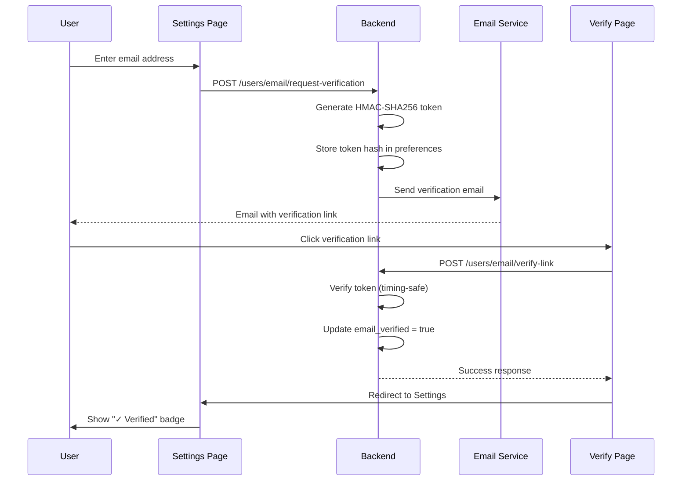

# Email Verification System

> **Last Updated**: January 2026  
> **Version**: 1.0.0  
> **Status**: Production Ready

## Overview

The DeJaVu Email Verification System allows wallet-only users to add and verify email addresses. This provides enhanced account security, notification preferences, and account recovery options.

---

## Architecture

```
┌─────────────────────────────────────────────────────────────────┐
│                     EMAIL VERIFICATION FLOW                      │
├─────────────────────────────────────────────────────────────────┤
│                                                                  │
│  ┌──────────────┐     ┌──────────────┐     ┌──────────────────┐ │
│  │   Settings   │────▶│   Backend    │────▶│   Email Service  │ │
│  │   (Frontend) │     │   (NestJS)   │     │   (SMTP/Resend)  │ │
│  └──────────────┘     └──────────────┘     └──────────────────┘ │
│         │                    │                      │           │
│         │                    ▼                      │           │
│         │            ┌──────────────┐               │           │
│         │            │   Supabase   │               │           │
│         │            │  (Profiles)  │               │           │
│         │            └──────────────┘               │           │
│         │                    │                      │           │
│         ◀────────────────────┴──────────────────────┘           │
│                                                                  │
└─────────────────────────────────────────────────────────────────┘
```

---

## Security Features

| Feature | Implementation |
|---------|---------------|
| **Token Hashing** | HMAC-SHA256 with secret key |
| **Timing-Safe Comparison** | `crypto.timingSafeEqual()` |
| **Rate Limiting** | Max 3 verification emails per hour |
| **Token Expiry** | 30 minutes |
| **Single Use** | Tokens cleared after verification |
| **Anti-Replay** | Token consumed on first use |

---

## API Endpoints

### 1. Request Email Verification

**Endpoint**: `POST /api/v1/users/email/request-verification`  
**Auth**: Required (JWT)

```typescript
// Request
{
  "email": "user@example.com"
}

// Response (200 OK)
{
  "message": "Verification link sent to your email"
}
```

**Security Checks**:
- Email format validation
- Email uniqueness check
- Rate limiting (3/hour)
- User must be authenticated

---

### 2. Verify Email (Public)

**Endpoint**: `POST /api/v1/users/email/verify-link`  
**Auth**: Not Required (public endpoint)

```typescript
// Request
{
  "email": "user@example.com",
  "token": "64-character-hex-token",
  "uid": "user-uuid" // Optional, for direct lookup
}

// Response (200 OK)
{
  "message": "Email verified successfully",
  "email": "user@example.com",
  "emailVerified": true,
  "userId": "uuid"
}
```

---

### 3. Get Current User

**Endpoint**: `GET /api/v1/auth/me`  
**Auth**: Required (JWT)

```typescript
// Response (200 OK)
{
  "id": "uuid",
  "email": "user@example.com",
  "email_verified": true,  // ← Email verification status
  "fullName": "John Doe",
  "avatarUrl": "https://...",
  "bio": "...",
  "walletAddresses": [...],
  "preferences": {...},
  "createdAt": "2026-01-27T..."
}
```

---

## Database Schema

### Migration: `036_email_verified_column.sql`

```sql
-- Add email_verified column to profiles
ALTER TABLE public.profiles 
ADD COLUMN email_verified BOOLEAN DEFAULT false;

-- Create index for verified email queries
CREATE INDEX idx_profiles_email_verified 
ON public.profiles(email_verified) 
WHERE email IS NOT NULL;
```

### Token Storage (Preferences Fallback)

When `email_verified` column doesn't exist, tokens are stored in user preferences:

```typescript
{
  preferences: {
    email_verification: {
      email: "user@example.com",
      token_hash: "hmac-sha256-hash",
      expires_at: 1706389200000,  // Unix timestamp
      created_at: 1706387400000,
      requests_count: 1,
      last_request_at: "2026-01-27T22:30:00Z"
    },
    email_verified_flag: true  // Fallback for email_verified column
  }
}
```

---

## Implementation Details

### Backend Files

| File | Description |
|------|-------------|
| `users.service.ts` | Token generation, storage, verification logic |
| `users.controller.ts` | API endpoints for verification |
| `auth.service.ts` | `getCurrentUser()` includes `email_verified` |
| `email.service.ts` | Sends verification emails via SMTP |

### Frontend Files

| File | Description |
|------|-------------|
| `settings/index.tsx` | Email input with Verified/Unverified badges |
| `VerifyEmailPage.tsx` | Handles verification link clicks |
| `api.ts` | `authApi.me()` maps snake_case to camelCase |
| `AuthContext.tsx` | User interface includes `emailVerified` |

---

## User Flow



---

## Configuration

### Environment Variables

```env
# Email Service (Required)
SMTP_HOST=smtp.resend.com
SMTP_PORT=587
SMTP_SECURE=false
SMTP_USER=resend
SMTP_PASS=re_xxxxx
EMAIL_FROM=noreply@yourdomain.com

# Token Settings (Optional - defaults shown)
VERIFICATION_TOKEN_EXPIRY_MINUTES=30
VERIFICATION_SECRET_KEY=your-256-bit-secret-key
```

---

## Error Handling

| Error | Status | Message |
|-------|--------|---------|
| Invalid email format | 400 | "Invalid email format" |
| Email already in use | 400 | "This email is already in use" |
| Rate limit exceeded | 400 | "Too many verification attempts. Please wait an hour." |
| Token expired | 400 | "This verification link has expired. Please request a new one." |
| Invalid token | 400 | "Invalid verification token" |
| User not found | 400 | "Invalid verification link" |

---

## Testing

### Manual Testing Steps

1. **Login with wallet** → Navigate to Settings → Profile
2. **Enter email address** → Click "Send Link"
3. **Check email** → Click verification link
4. **Verify success** → Should see green "✓ Verified" badge

### Test Cases

```typescript
describe('Email Verification', () => {
  it('should send verification email for valid email');
  it('should reject already used email');
  it('should rate limit excessive requests');
  it('should reject expired tokens');
  it('should verify valid token');
  it('should prevent token reuse');
});
```

---

## Changelog

### v1.0.0 (January 2026)
- Initial implementation
- HMAC-SHA256 token security
- Rate limiting (3/hour)
- 30-minute token expiry
- Preferences-based storage (no migration required)
- `email_verified` column migration (optional)
- Frontend badge display (Verified/Unverified)
