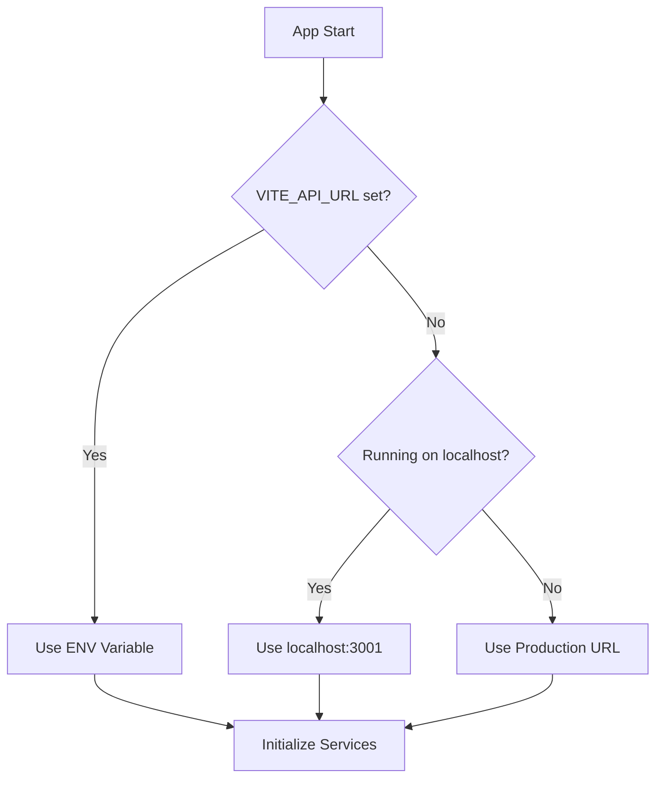

# Frontend Configuration Guide

> **DeJaVu Web Frontend Configuration**  
> Version 1.0.0 | Published: January 16, 2026  
> Author: DeJaVu Engineering Team

---

## Overview

This document describes the frontend configuration system for the DeJaVu web application, including environment-aware API endpoint configuration, production deployment setup, and best practices.

---

## Table of Contents

1. [Configuration Architecture](#1-configuration-architecture)
2. [Environment Variables](#2-environment-variables)
3. [Centralized Config Module](#3-centralized-config-module)
4. [Production Deployment](#4-production-deployment)
5. [WebSocket Configuration](#5-websocket-configuration)
6. [Troubleshooting](#6-troubleshooting)

---

## 1. Configuration Architecture

### 1.1 Design Principles

The frontend configuration follows these principles:

| Principle | Implementation |
|-----------|----------------|
| **Environment Awareness** | Auto-detect production vs development |
| **Centralized Config** | Single source of truth in `src/config/index.ts` |
| **Fallback Defaults** | Graceful degradation to localhost for development |
| **Type Safety** | Full TypeScript support with `vite-env.d.ts` |

### 1.2 Configuration Flow



---

## 2. Environment Variables

### 2.1 Available Variables

| Variable | Required | Default | Description |
|----------|----------|---------|-------------|
| `VITE_API_URL` | ❌ | Auto-detect | Backend API URL with `/api/v1` path |
| `VITE_WS_URL` | ❌ | Derived from API URL | WebSocket server URL |
| `VITE_SUPABASE_URL` | ✅ | - | Supabase project URL |
| `VITE_SUPABASE_ANON_KEY` | ✅ | - | Supabase anonymous key |
| `VITE_PRIVY_APP_ID` | ✅ | - | Privy application ID |

### 2.2 Environment File Examples

#### Development (`.env.local`)

```env
# Local development (optional - auto-defaults to localhost)
VITE_API_URL=http://localhost:3001/api/v1
VITE_SUPABASE_URL=https://your-project.supabase.co
VITE_SUPABASE_ANON_KEY=your-anon-key
VITE_PRIVY_APP_ID=your-privy-app-id
```

#### Production (`.env.production`)

```env
# Production API backend
VITE_API_URL=https://backend-dejavu.onrender.com/api/v1
VITE_SUPABASE_URL=https://your-project.supabase.co
VITE_SUPABASE_ANON_KEY=your-anon-key
VITE_PRIVY_APP_ID=your-privy-app-id
```

### 2.3 Type Definitions

The environment variables are typed in `src/vite-env.d.ts`:

```typescript
interface ImportMetaEnv {
    readonly VITE_API_URL: string;
    readonly VITE_WS_URL: string;
    readonly VITE_SUPABASE_URL: string;
    readonly VITE_SUPABASE_ANON_KEY: string;
    readonly VITE_PRIVY_APP_ID: string;
}

interface ImportMeta {
    readonly env: ImportMetaEnv;
}
```

---

## 3. Centralized Config Module

### 3.1 Location

```
apps/web/src/config/index.ts
```

### 3.2 Exported Functions

| Function | Returns | Description |
|----------|---------|-------------|
| `getApiUrl()` | `string` | Get the API base URL with `/api/v1` |
| `getWsUrl()` | `string` | Get the WebSocket server URL |

### 3.3 Exported Constants

| Constant | Type | Description |
|----------|------|-------------|
| `API_URL` | `string` | Pre-computed API URL |
| `WS_URL` | `string` | Pre-computed WebSocket URL |
| `config` | `object` | Full configuration object |

### 3.4 Auto-Detection Logic

The configuration module automatically detects the environment:

```typescript
export function getApiUrl(): string {
    // Priority 1: Explicit environment variable
    if (import.meta.env.VITE_API_URL) {
        return import.meta.env.VITE_API_URL;
    }

    // Priority 2: Auto-detect production (non-localhost hostname)
    if (typeof window !== 'undefined') {
        const hostname = window.location.hostname;
        if (hostname !== 'localhost' && hostname !== '127.0.0.1') {
            return 'https://backend-dejavu.onrender.com/api/v1';
        }
    }

    // Priority 3: Fallback to localhost for development
    return 'http://localhost:3001/api/v1';
}
```

### 3.5 Usage in Services

```typescript
// In src/services/api.ts
import { API_URL } from '../config';

// In src/services/sports.service.ts
import { API_URL } from '../config';
const API_BASE_URL = API_URL;

// In src/hooks/useSportsSocket.ts
import { WS_URL } from '../config';
const SOCKET_URL = WS_URL;
```

---

## 4. Production Deployment

### 4.1 Production URLs

| Service | URL |
|---------|-----|
| **API Backend** | `https://backend-dejavu.onrender.com/api/v1` |
| **WebSocket** | `https://backend-dejavu.onrender.com` |

### 4.2 Deployment Checklist

- [x] Centralized config module created
- [x] All services use config module
- [x] Auto-detection for production environment
- [x] Type definitions updated
- [x] Build tested successfully

### 4.3 Build Commands

```bash
# Development build
pnpm run dev

# Production build
pnpm run build

# Preview production build
pnpm run preview
```

---

## 5. WebSocket Configuration

### 5.1 WebSocket Hooks

The following hooks use the centralized WebSocket URL:

| Hook | Path | Purpose |
|------|------|---------|
| `useSportsSocket` | `src/hooks/useSportsSocket.ts` | Sports event real-time updates |
| `useSportsSocket` | `src/app/hooks/useSportsSocket.ts` | Alternative sports socket hook |
| `useSportsRealtime` | `src/app/hooks/useSportsRealtime.ts` | Real-time sports data synchronization |

### 5.2 WebSocket Namespace

All sports-related WebSocket connections use the `/sports` namespace:

```typescript
const socket = io(`${WS_URL}/sports`, {
    transports: ['websocket'],
    autoConnect: true,
    reconnection: true,
    reconnectionAttempts: 5,
    reconnectionDelay: 1000,
});
```

### 5.3 Socket Events

| Event | Direction | Description |
|-------|-----------|-------------|
| `join-sport` | Client → Server | Subscribe to sport updates |
| `leave-sport` | Client → Server | Unsubscribe from sport |
| `join-event` | Client → Server | Subscribe to specific event |
| `leave-event` | Client → Server | Unsubscribe from event |
| `sports.update` | Server → Client | Sports event update |
| `market.update` | Server → Client | Market price update |

---

## 6. Troubleshooting

### 6.1 Common Issues

#### API calls failing in production

**Symptom:** API calls return network errors or CORS issues.

**Solution:**
1. Check that `VITE_API_URL` is set correctly in production
2. Verify CORS is configured on the backend to allow the frontend origin
3. Ensure the backend is running and accessible

#### WebSocket connection failing

**Symptom:** Real-time updates not working.

**Solution:**
1. Verify `VITE_WS_URL` or `VITE_API_URL` is set correctly
2. Check browser console for WebSocket connection errors
3. Ensure backend WebSocket gateway is running

#### Wrong API URL in production

**Symptom:** Frontend uses localhost in production.

**Solution:**
1. Ensure the frontend is deployed to a non-localhost domain
2. Or set `VITE_API_URL` explicitly in the deployment environment

### 6.2 Debug Tips

```typescript
// Add to browser console to check current config
import { config } from './config';
console.log('Current config:', config);
console.log('API URL:', config.apiUrl);
console.log('WS URL:', config.wsUrl);
console.log('Is Production:', config.isProduction);
```

---

## Files Modified

The following files were updated to support production API:

| File | Change |
|------|--------|
| `src/config/index.ts` | **NEW** - Centralized configuration module |
| `src/services/api.ts` | Updated to use centralized config |
| `src/services/sports.service.ts` | Removed hardcoded localhost, uses config |
| `src/hooks/useSportsSocket.ts` | Updated to use centralized WS_URL |
| `src/app/hooks/useSportsSocket.ts` | Updated to use centralized WS_URL |
| `src/app/hooks/useSportsRealtime.ts` | Updated to use centralized WS_URL, fixed TypeScript errors |
| `src/vite-env.d.ts` | Added `VITE_WS_URL` type definition |

---

## Version History

| Version | Date | Changes |
|---------|------|---------|
| 1.0.0 | Jan 16, 2026 | Initial frontend configuration documentation |

---

*This document is maintained by the DeJaVu Engineering Team.*
