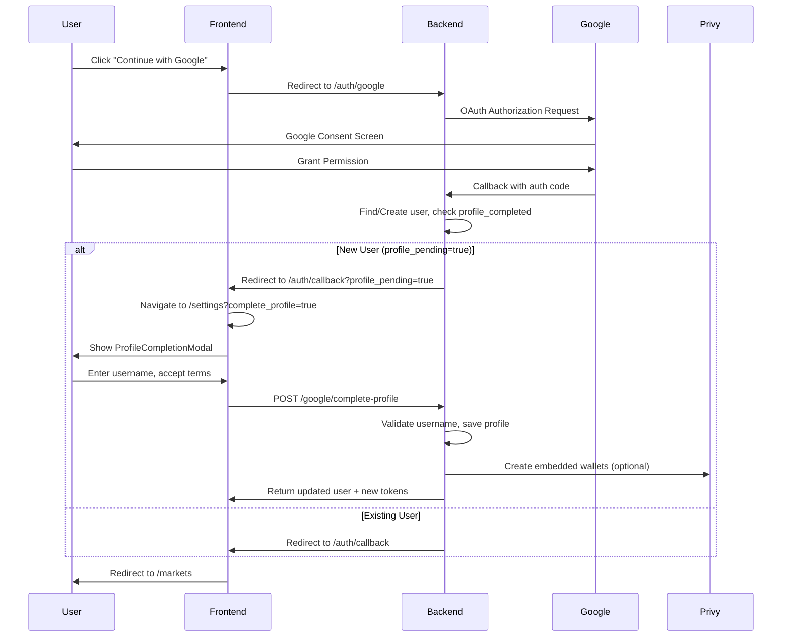

# Google OAuth & Privy Embedded Wallet Integration

> Technical documentation for Google OAuth authentication with Privy embedded wallet integration.
> Version 1.0.0 | Published: January 22, 2026

---

## Overview

DeJaVu implements a comprehensive **Google OAuth 2.0** authentication flow with **Privy embedded wallet** creation. The system follows OWASP security guidelines, implements anti-throttling measures, and provides a seamless user experience across mobile and desktop devices.

| Feature | Implementation |
|---------|----------------|
| **OAuth Provider** | Google OAuth 2.0 via Passport.js |
| **Wallet Provider** | Privy (Ethereum, Solana, Sui) |
| **Security** | OWASP A05/A07 compliant, CSRF protection |
| **Frontend** | React + PrivyProvider + ProfileCompletionModal |
| **Rate Limiting** | 5 req/min for OAuth endpoints |

---

## Authentication Flow

### Sequence Diagram



---

## Backend Implementation

### Environment Variables

```env
# Google OAuth
GOOGLE_CLIENT_ID=your_google_client_id
GOOGLE_CLIENT_SECRET=your_google_client_secret
GOOGLE_CALLBACK_URL=http://localhost:3001/api/v1/auth/google/callback

# Privy (for embedded wallets)
PRIVY_APP_ID=your_privy_app_id
PRIVY_APP_SECRET=your_privy_app_secret
```

### Google Strategy

**File:** `apps/api/src/modules/auth/strategies/google.strategy.ts`

```typescript
@Injectable()
export class GoogleStrategy extends PassportStrategy(Strategy, 'google') {
    constructor(private readonly configService: ConfigService) {
        super({
            clientID: configService.get<string>('GOOGLE_CLIENT_ID'),
            clientSecret: configService.get<string>('GOOGLE_CLIENT_SECRET'),
            callbackURL: configService.get<string>('GOOGLE_CALLBACK_URL'),
            scope: ['email', 'profile'],
        });
    }

    async validate(
        accessToken: string,
        refreshToken: string,
        profile: Profile,
        done: VerifyCallback,
    ): Promise<void> {
        const { id, emails, displayName, photos } = profile;
        const user = {
            googleId: id,
            email: emails?.[0]?.value,
            fullName: displayName,
            avatarUrl: photos?.[0]?.value,
        };
        done(null, user);
    }
}
```

### API Endpoints

| Method | Path | Auth | Description |
|--------|------|------|-------------|
| GET | `/auth/google` | Public | Initiate Google OAuth flow |
| GET | `/auth/google/callback` | Public | OAuth callback handler |
| POST | `/auth/google/complete-profile` | JWT | Complete profile after OAuth |
| GET | `/auth/check-username/:username` | JWT | Check username availability |

### Profile Completion DTO

**File:** `apps/api/src/modules/auth/dto/google-profile.dto.ts`

```typescript
import { IsString, IsBoolean, Matches, MinLength, MaxLength } from 'class-validator';

export class GoogleProfileCompletionDto {
    @IsString()
    @MinLength(3)
    @MaxLength(30)
    @Matches(/^[a-zA-Z][a-zA-Z0-9_]{2,29}$/, {
        message: 'Username must start with a letter and contain only alphanumeric characters and underscores',
    })
    username: string;

    @IsString()
    @MaxLength(100)
    fullName?: string;

    @IsBoolean()
    agreedToTerms: boolean;

    @IsBoolean()
    agreedToPrivacy: boolean;
}
```

### Auth Service Methods

**File:** `apps/api/src/modules/auth/auth.service.ts`

| Method | Purpose |
|--------|---------|
| `handleGoogleCallbackEnhanced()` | Process OAuth callback, create/find user |
| `checkUsernameAvailable()` | Check if username is available (case-insensitive) |
| `completeGoogleProfile()` | Complete profile with username and terms acceptance |
| `generateOAuthState()` | Generate CSRF state token |
| `verifyOAuthState()` | Verify and consume state token |

---

## Database Schema

### Migration: 024_google_oauth_profile.sql

**New Columns on `profiles` table:**

| Column | Type | Description |
|--------|------|-------------|
| `username` | VARCHAR(30) | Unique username (3-30 chars, alphanumeric+underscore) |
| `google_id` | TEXT | Google OAuth user ID |
| `privy_user_id` | TEXT | Privy DID for embedded wallet |
| `auth_provider` | TEXT | 'email', 'google', or 'wallet' |
| `profile_completed` | BOOLEAN | Whether profile setup is complete |
| `agreed_to_terms_at` | TIMESTAMPTZ | Terms acceptance timestamp |
| `agreed_to_privacy_at` | TIMESTAMPTZ | Privacy policy acceptance timestamp |

### Database Functions

| Function | Purpose |
|----------|---------|
| `validate_username(p_username)` | Validate username format per OWASP guidelines |
| `check_username_available(p_username)` | Check availability with normalization |
| `complete_google_profile(...)` | Atomic profile completion transaction |
| `find_or_prepare_google_user(...)` | Find existing user or prepare for creation |
| `verify_oauth_state(p_state_token)` | Verify CSRF state token (single use) |
| `cleanup_expired_oauth_tokens()` | Remove expired state tokens |

### OAuth State Tokens Table (CSRF Protection)

```sql
CREATE TABLE oauth_state_tokens (
    id UUID PRIMARY KEY DEFAULT gen_random_uuid(),
    state_token TEXT NOT NULL UNIQUE,
    provider TEXT NOT NULL DEFAULT 'google',
    ip_address TEXT,
    user_agent TEXT,
    created_at TIMESTAMPTZ DEFAULT NOW(),
    expires_at TIMESTAMPTZ DEFAULT NOW() + INTERVAL '10 minutes',
    used_at TIMESTAMPTZ,
    CONSTRAINT oauth_state_token_format CHECK (LENGTH(state_token) >= 32)
);
```

---

## Frontend Implementation

### Environment Variables

```env
VITE_API_URL=http://localhost:3001/api/v1
VITE_GOOGLE_CLIENT_ID=your_google_client_id
VITE_PRIVY_APP_ID=your_privy_app_id
```

### PrivyProvider Configuration

**File:** `apps/web/src/app/layouts/RootLayout.tsx`

```typescript
import { PrivyProvider } from '@privy-io/react-auth';

const privyConfig = {
    appearance: {
        theme: 'dark' as const,
        accentColor: '#6366f1' as `#${string}`,
        logo: '/logo.png',
    },
    embeddedWallets: {
        ethereum: { createOnLogin: 'off' as const },
        solana: { createOnLogin: 'off' as const },
    },
    loginMethods: ['google' as const, 'email' as const],
};

export function RootLayout() {
    return (
        <PrivyProvider appId={PRIVY_APP_ID} config={privyConfig}>
            {/* ... app content ... */}
        </PrivyProvider>
    );
}
```

### Component Architecture

| Component | File | Purpose |
|-----------|------|---------|
| `AuthModal` | `components/auth/AuthModal.tsx` | Login/signup modal with Google button |
| `AuthCallbackPage` | `pages/auth/AuthCallbackPage.tsx` | OAuth callback handler |
| `AuthErrorPage` | `pages/auth/AuthErrorPage.tsx` | OAuth error display |
| `ProfileCompletionModal` | `components/auth/ProfileCompletionModal.tsx` | Username & terms form |
| `SettingsPage` | `pages/settings/index.tsx` | Profile completion trigger |

### AuthCallbackPage

**File:** `apps/web/src/app/pages/auth/AuthCallbackPage.tsx`

Handles:
- Token extraction from URL params
- `profile_pending` detection
- Navigation to `/settings?complete_profile=true` for new users
- Premium loading animation

### ProfileCompletionModal

**File:** `apps/web/src/app/components/auth/ProfileCompletionModal.tsx`

Features:
- Real-time username validation with debouncing (500ms)
- Terms of Service checkbox
- Privacy Policy checkbox
- Glassmorphic responsive design
- Error handling with toast notifications

---

## Security Features

### OWASP Compliance

| Risk | Implementation | Status |
|------|----------------|--------|
| A05: Security Misconfiguration | CSRF state tokens, secure cookies | ✅ |
| A07: Auth Failures | Rate limiting, brute force protection | ✅ |
| A03: Injection | class-validator, parameterized queries | ✅ |

### Anti-Throttling Measures

| Layer | Implementation |
|-------|----------------|
| Frontend | 500ms debouncing on username checks |
| Backend | express-rate-limit (5 req/min for OAuth) |
| Database | Indexed username lookups |

### Rate Limiting Configuration

```typescript
// apps/api/src/main.ts
const authLimiter = rateLimit({
    windowMs: 60 * 1000, // 1 minute
    max: 5, // 5 requests
    message: 'Too many authentication requests',
});

app.use('/api/v1/auth', authLimiter);
```

### Reserved Usernames

The following usernames are blocked:
- `admin`, `administrator`, `mod`, `moderator`
- `dejavu`, `official`, `system`, `support`, `help`
- `root`, `api`, `www`, `mail`, `bot`
- `null`, `undefined`, `anonymous`, `guest`, `test`, `demo`

---

## Deployment

### Google Cloud Console Setup

1. Go to [Google Cloud Console](https://console.cloud.google.com/)
2. Create or select a project
3. Navigate to **APIs & Services** → **Credentials**
4. Create **OAuth 2.0 Client ID** (Web application type)
5. Add **Authorized redirect URIs**:
   - Development: `http://localhost:3001/api/v1/auth/google/callback`
   - Production: `https://your-backend.com/api/v1/auth/google/callback`

### Render Backend Configuration

Environment variables required on Render:

| Variable | Value |
|----------|-------|
| `GOOGLE_CLIENT_ID` | From Google Cloud Console |
| `GOOGLE_CLIENT_SECRET` | From Google Cloud Console |
| `GOOGLE_CALLBACK_URL` | `https://backend-dejavu.onrender.com/api/v1/auth/google/callback` |
| `PRIVY_APP_ID` | From Privy Dashboard |
| `PRIVY_APP_SECRET` | From Privy Dashboard |

### Troubleshooting

| Error | Cause | Solution |
|-------|-------|----------|
| `redirect_uri_mismatch` | Callback URL not in Google Console | Add exact URL to Authorized redirect URIs |
| `invalid_client` | Wrong Client ID/Secret | Verify credentials match Google Console |
| `access_denied` | User denied OAuth consent | User must accept permissions |
| `Rate limit exceeded` | Too many requests | Wait for rate limit window to reset |

---

## Testing Checklist

- [ ] Click "Continue with Google" → redirects to Google consent
- [ ] After consent → redirects to `/auth/callback`
- [ ] New user → shows ProfileCompletionModal
- [ ] Username validation works in real-time
- [ ] Reserved usernames are rejected
- [ ] Duplicate usernames are rejected
- [ ] Terms & Privacy checkboxes are required
- [ ] Profile completion → success toast → back to markets
- [ ] Existing user login → direct to /markets
- [ ] Mobile responsive design works
- [ ] Privy wallet creation (if configured)

---

## Related Documentation

- [Doc.md](./Doc.md) - Main platform documentation
- [Frontend-Architecture.md](./Frontend-Architecture.md) - Frontend patterns
- [Guidelines.md](./Guidelines.md) - Development guidelines
