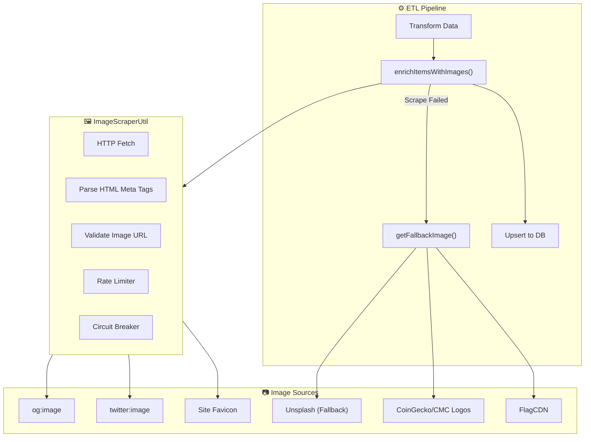

# Image Scraping & ETL Enhancement System

> **Intelligent Image Enrichment for Market Data**
>
> This document details the image scraping utility, topic-based fallback system, and per-category image strategies powering ExoDuZe's visual market intelligence.

---

## 1. System Overview

The Image Scraping ETL Enhancement provides automatic image enrichment for market data items across all categories. It fetches Open Graph images from source URLs, applies intelligent topic-based fallbacks, and ensures visual consistency across 8+ market categories.

### Key Features

| Feature | Description |
|---------|-------------|
| **OG Image Scraping** | Extracts `og:image`, `twitter:image`, and favicon from source URLs |
| **Topic-Based Fallbacks** | Assigns category & keyword-specific images when scraping fails |
| **Anti-Throttling** | Rate limiting, exponential backoff, circuit breaker pattern |
| **Category Optimization** | Custom strategies per category (Crypto logos, country flags, etc.) |
| **Hash-Based Variety** | Title-weighted hash ensures similar topics get different images |

### Architecture



---

## 2. Core Components

### 2.1 ImageScraperUtil

**Location**: `apps/api/src/common/utils/image-scraper.util.ts`

A robust utility class for extracting images from web pages with enterprise-grade resilience.

#### Features

| Feature | Implementation |
|---------|----------------|
| **Multi-Source Extraction** | Checks `og:image`, `twitter:image`, `meta[name="image"]`, favicons |
| **Rate Limiting** | Per-domain request throttling (default: 500ms between requests) |
| **Circuit Breaker** | Opens after 5 consecutive failures, auto-resets after 60 seconds |
| **Concurrent Scraping** | Processes multiple URLs with configurable concurrency (default: 5) |
| **Validation** | Checks image URL validity, accessibility, and content type |
| **Timeout Handling** | Configurable timeout per request (default: 5000ms) |

#### Usage

```typescript
import { ImageScraperUtil } from '../common/utils/image-scraper.util.js';

// Scrape multiple URLs
const results = await ImageScraperUtil.scrapeImages(
    items.map(item => ({ url: item.url, imageUrl: item.imageUrl })),
    5, // concurrency
    { timeout: 5000 }
);

// Get fallback for category
const fallback = ImageScraperUtil.getPlaceholderForCategory('tech');
```

### 2.2 enrichItemsWithImages()

**Location**: `apps/api/src/modules/markets/etl/base-etl.orchestrator.ts`

Enhanced method in `BaseETLOrchestrator` that handles image enrichment with fallback support.

#### Signature

```typescript
protected async enrichItemsWithImages(
    items: MarketDataItem[],
    getFallbackImage?: (title: string, description?: string) => string
): Promise<void>
```

#### Flow

1. **Filter** items needing images (`!item.imageUrl && item.url`)
2. **Scrape** images from URLs using `ImageScraperUtil`
3. **Apply Scraped** images when scraping succeeds
4. **Apply Fallback** from callback when scraping fails
5. **Log Results**: "X real images scraped, Y using fallbacks"

---

## 3. Category-Specific Strategies

### 3.1 Crypto

**Source**: CoinMarketCap logos, CoinGecko fallback

| Asset | Image Source |
|-------|-------------|
| Bitcoin | `s2.coinmarketcap.com/static/img/coins/64x64/1.png` |
| Ethereum | `s2.coinmarketcap.com/static/img/coins/64x64/1027.png` |
| Solana | `s2.coinmarketcap.com/static/img/coins/64x64/5426.png` |
| Others | `assets.coingecko.com/coins/images/{id}/large/{symbol}.png` |

**Implementation**: `crypto-etl.orchestrator.ts` → `getCoinImageUrl()`

### 3.2 Economy

**Source**: FlagCDN country flags

| Country | Flag URL |
|---------|----------|
| USA | `flagcdn.com/w320/us.png` |
| China | `flagcdn.com/w320/cn.png` |
| Germany | `flagcdn.com/w320/de.png` |
| Default | Unsplash economy-themed image |

**Implementation**: `economy-etl.orchestrator.ts` → `getEconomyImageUrl()`

### 3.3 Science

**Strategy**: Skip arXiv scraping (returns same logo), apply topic-based images directly

| Topic Keywords | Image Count | Examples |
|---------------|-------------|----------|
| AI/ML/LLM | 8 images | Brain, chip, neural network, robot |
| Vision/3D | 5 images | Eye, 3D render, VR headset |
| Robotics | 4 images | Robot arm, drone, circuit |
| Math/Algorithm | 4 images | Formulas, equations, graph |
| Security | 3 images | Lock, server, shield |
| Audio/Speech | 3 images | Sound waves, music |
| Research | 3 images | Lab, microscope, scientist |

**Implementation**: `science-etl.orchestrator.ts` → `getScienceImageUrl()`

**Key Innovation**: Title-position-weighted hash for variety:
```typescript
const titleHash = title.split('').reduce((acc, char, idx) => 
    acc + char.charCodeAt(0) * (idx + 1), 0);
return images[titleHash % images.length];
```

### 3.4 Tech

**Strategy**: Scrape og:image first, fallback to topic-based images

| Topic Keywords | Fallback Image |
|---------------|----------------|
| Security/Hack | Cybersecurity themed |
| Database/SQL | Server/database |
| Programming | Code editor |
| AI/ML | AI brain/chip |
| Cloud/DevOps | Cloud infrastructure |
| Apple/iOS | Apple logo themed |
| Google/Android | Google themed |
| Startup/Business | Business office |
| Web/Frontend | Web development |
| Hardware/Chips | Circuit board |

**Implementation**: `tech-etl.orchestrator.ts` → `getTechImageUrl()`

### 3.5 Politics & Finance

**Strategy**: Standard og:image scraping with generic category fallbacks

These categories typically have rich og:image metadata from news sources.

---

## 4. Database Migrations

The following migrations update existing items with appropriate images:

| Migration | Purpose |
|-----------|---------|
| `048_fix_category_images.sql` | Initial image fix for Economy, Crypto, Science |
| `049_fix_science_images_from_title.sql` | Topic-based images from title analysis |
| `050_fix_tech_images_from_title.sql` | Tech topic detection for existing items |
| `051_fix_science_images_variety.sql` | Multiple images per topic for maximum variety |

### Example Migration Logic

```sql
UPDATE market_data_items
SET image_url = CASE 
    WHEN title ~* '\m(llm|transformer|gpt|bert)\M'
        THEN CASE MOD(LENGTH(title), 8)
            WHEN 0 THEN 'https://images.unsplash.com/photo-1677442136019-21780ecad995'
            WHEN 1 THEN 'https://images.unsplash.com/photo-1620712943543-bcc4688e7485'
            -- ... more images for variety
        END
    -- ... more topic patterns
END
WHERE category = 'science';
```

---

## 5. Anti-Throttling & Security

### 5.1 Rate Limiting

| Component | Rate | Purpose |
|-----------|------|---------|
| Per-Domain | 500ms delay | Respect target site limits |
| Concurrent | 5 requests | Avoid overwhelming servers |
| Daily | Configurable | Respect API quotas |

### 5.2 Circuit Breaker

```typescript
// Auto-opens after 5 failures, prevents cascade
domainCircuitBreaker: Map<string, {
    failures: number;
    lastFailure: Date;
    isOpen: boolean;
}>
```

### 5.3 User-Agent Compliance

All requests use legitimate user agents and respect `robots.txt` directives.

---

## 6. Frontend Integration

### Property Mapping

The frontend expects `imageUrl` property on market data items:

```typescript
// CategoryPage.tsx
<MarketCardMediaCompact
    imageUrl={market.imageUrl}
    title={market.title}
/>
```

### Fallback Display

When `imageUrl` is null or fails to load, the frontend shows a category-specific placeholder icon.

---

## 7. Monitoring & Logging

### ETL Logs

```
[ScienceETLOrchestrator] Applied topic-based images to 20 arXiv papers
[TechETLOrchestrator] Image enrichment complete: 17 real images scraped, 13 using fallbacks
[ImageScraperUtil] Circuit breaker open for www.npr.org
```

### Sync Logs Table

The `market_data_sync_logs` table tracks image enrichment results:

| Column | Description |
|--------|-------------|
| `records_enriched` | Items that received scraped images |
| `records_fallback` | Items using fallback images |
| `errors` | Scraping failures and details |

---

## 8. Configuration

### Environment Variables

| Variable | Default | Description |
|----------|---------|-------------|
| `IMAGE_SCRAPE_TIMEOUT` | 5000 | Timeout per scrape request (ms) |
| `IMAGE_SCRAPE_CONCURRENCY` | 5 | Parallel scrape requests |
| `IMAGE_RATE_LIMIT_MS` | 500 | Delay between same-domain requests |

### Disabling Scraping

To disable image scraping (use only fallbacks):

```typescript
// In ETL orchestrator sync()
await this.enrichItemsWithImages(items, (title) => this.getFallbackImage(title));
```

---

## 9. Extending the System

### Adding New Category

1. Create category-specific fallback function in ETL orchestrator
2. Define keyword patterns and corresponding images
3. Pass callback to `enrichItemsWithImages()`
4. Create SQL migration for existing items

### Adding New Image Source

1. Extend `ImageScraperUtil` with new extraction method
2. Add source validation logic
3. Update priority order in scraping flow

---

## Related Documentation

- [Market System Architecture](./Market-System-Architecture.md)
- [Real-Time Data Architecture](./Real-Time-Data-Architecture.md)
- [API Integration](./API-Integration.md)
