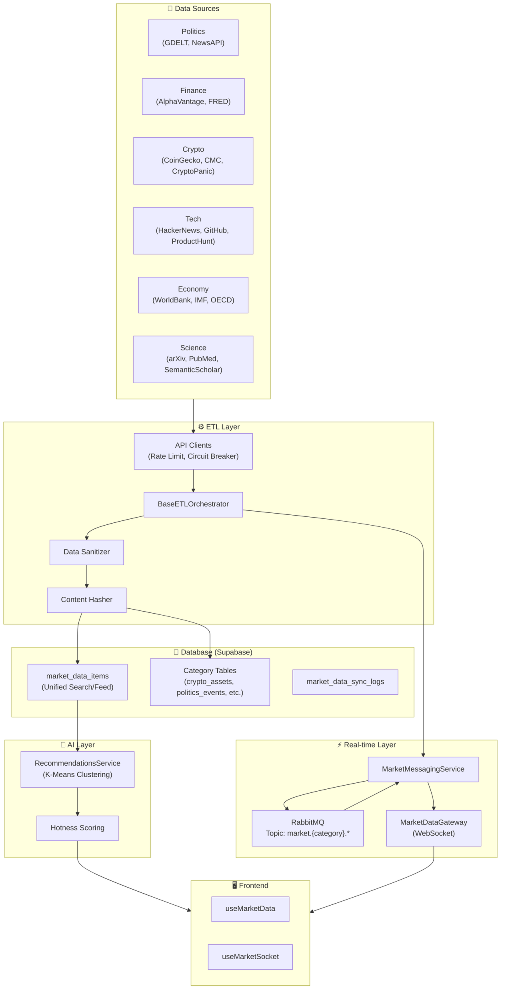

# Market System Architecture

> **Technical Blueprint for Multi-Category AI Agent Competitions**
>
> This document details the unified data ingestion, storage, and streaming architecture powering ExoDuZe's AI agent competitions. It covers the database schema, ETL pipelines, and real-time integration via RabbitMQ and WebSockets.

---

## 1. System Overview

The Market System is designed to ingest high-volume, real-time data from diverse sources (APIs, RSS, On-chain) and normalize it into a unified format (`market_data_items`) while maintaining category-specific richness in dedicated tables.

### Architecture Diagram

### 1.1 New Capabilities (AI & Recommendations)
*   **AI Recommendations**: A dedicated K-Means clustering engine (`RecommendationsService`) now powers the "For You" feed, grouping users and content into archetypes (e.g., "Crypto Whale" vs "Macro Analyst").
*   **Global Top Markets**: A unified "Hotness Score" aggregates betting volume with high-impact news signals to rank the most important content across all 8 categories.
*   **See detailed docs**: [AI Recommendation System](./AI-Recommendations-System.md)

---

## 2. Database Integration (Supabase)

The database schema uses a **Hybrid Relational Model**. A central `market_data_items` table provides a unified view for feeds, search, and global trends, while specialized tables store category-specific data types (e.g., election dates, crypto prices, scientific citations).

### 2.1 Unified Core Tables

**`market_data_items`**
The central hub for all market intelligence.
*   **Purpose**: Unifies news, events, prices, and signals into a single queryable stream.
*   **Key Columns**:
    *   `category`: Enum (politics, crypto, tech, etc.)
    *   `source`: Enum (gdelt, coingecko, hackernews, etc.)
    *   `impact`: Low/Medium/High (for filtering noise)
    *   `sentiment_score`: AI-analyzed sentiment (-1.0 to 1.0)
    *   `content_hash`: SHA256 hash for deduplication relative to source.
    *   `entities`: JSONB array of extracted named entities.
*   **Indexing**: Optimized for temporal (`published_at`) and categorical queries.

**`market_data_sources`**
Configuration registry for all API integrations.
*   **Tracks**: Rate limits, API keys (env var references), health status, and sync history.
*   **Usage**: ETL orchestrators check this table before execution to respect quotas.

### 2.2 Category-Specific Schema

### 2.3 Cross-Cutting Aggregations

#### 📡 Aggregated Signals (`044_signals_data.sql`)
*   **`market_signals`**: Normalized signals from all categories with standardized `impact`, `sentiment`, and `confidence_score`.
*   **`trending_topics`**: Cross-category trend detection (e.g., "AI Regulation" appearing in Tech, Politics, and Economy).
*   **`signal_aggregations`**: Pre-computed metrics for dashboard widgets (Volume over time, Sentiment shifts).

#### 🏛️ Politics (`038_politics_data.sql`)
*   **`politics_events`**: Structured events (Elections, Summits, Legislation) with `event_date` and `country`.
*   **`politics_entities`**: Politicians, Parties, Organizations with sentiment tracking.
*   **`politics_elections`**: Dedicated table for managing election cycles, polls, and candidates.

#### 💹 Finance & Economy (`042_economy_data.sql`)
*   **`economy_global_indicators`**: Time-series data for GDP, Inflation, Unemployment (World Bank/IMF).
*   **`economy_countries`**: Macroeconomic profiles for countries.
*   **`economy_forecasts`**: Predictive data from major institutions.

#### ₿ Crypto (`041_crypto_data.sql`)
*   **`crypto_assets`**: Metadata for coins (BTC, ETH, SOL, HYPE, BNB).
*   **`crypto_prices`**: OHLCV data for charting.
*   **`crypto_fear_greed`**: Market sentiment tracking.
*   **`crypto_news`**: Aggregated news with "Hot" and "Important" flags.

#### 🧬 Science & Tech (`040_tech_data.sql`, `043_science_data.sql`)
*   **`tech_hn_stories`**: HackerNews items with point thresholds.
*   **`tech_github_trending`**: Trending repositories.
*   **`science_papers`**: Academic papers with citation counts and impact factors.

---

## 3. ETL Pipeline Architecture

The system uses a **Polymorphic ETL Orchestrator** pattern. Each category has a dedicated Orchestrator that extends `BaseETLOrchestrator`.

### 3.1 Base Components

**`BaseETLOrchestrator`**
*   **Responsibilities**:
    *   Managing sync intervals (Cron/Manual).
    *   Standardized logging (`market_data_sync_logs`).
    *   Error boundaries and retry logic.
    *   Publishing "New Item" events to RabbitMQ.

**`BaseAPIClient`**
All API clients extend this class to inherit enterprise-grade resilience features:
*   **Rate Limiting**: Token bucket algorithm to respect API quotas (per minute/day).
*   **Circuit Breaker**: Automatically stops requests to failing APIs to prevent cascading failures.
*   **Anti-Throttling**: Jittered exponential backoff for retries.
*   **Security**: Header sanitization and User-Agent compliance.

### 3.2 Data Flow Strategy

1.  **Fetch**: Client requests data from external API (e.g., IMF, CoinMarketCap).
2.  **Transform**: Data is mapped to a DTO (Data Transfer Object).
3.  **Deduplicate**: System checks `content_hash` against existing records.
4.  **Enrich**: 
    *   AI sentiment analysis or entity extraction.
    *   **Image Scraping**: Extracts `og:image` from source URLs with topic-based fallbacks.
5.  **Persist**:
    *   Insert into `market_data_items`.
    *   Upsert into category-specific table (e.g., `crypto_assets`).
6.  **Stream**: Publish `new_item` event to RabbitMQ.

> **See Also**: [Image Scraping & ETL Enhancement](./Image-Scraping-ETL.md) for detailed image enrichment strategies.

---

## 4. Real-time Streaming (RabbitMQ)

Real-time updates are distributed via a Publish-Subscribe model using RabbitMQ.

### 4.1 Topic Structure

Topic Format: `market.{category}.{type}`

| Topic Example | Description | Payload Data |
|---------------|-------------|--------------|
| `market.crypto.price_update` | Live price changes | `{ symbol, price, change24h }` |
| `market.politics.new_item` | New political event | `{ title, country, source }` |
| `market.tech.trending` | Github/HN Trend | `{ name, stars, link }` |
| `market.signals.alert` | High-impact signal | `{ type, severity, message }` |
| `market.sports.score` | Live match score | `{ matchId, home, away }` |

### 4.2 WebSocket Gateway

The `MarketMessagingService` consumes these RabbitMQ topics and broadcasts them to frontend clients via `MarketDataGateway` (Socket.IO).
*   **Batching**: Updates are batched (e.g., every 100ms) to prevent frontend flooding (Anti-Throttling).
*   **filtering**: Clients subscribe to specific "rooms" (e.g., `room:crypto`) to receive only relevant data.

---

## 5. API Mapping & Topic Curation

The following data sources are mapped to specific market topics to ensure high-quality, curated intelligence.

### 🏛️ Politics
*   **Primary Sources**: GDELT Project, NewsAPI, Reuters RSS, Google News RSS.
*   **Focus**: Global elections, major legislation, geopolitical conflicts.
*   **Streaming**: Real-time alerts on "High Impact" GDELT events.

### 💹 Finance
*   **Primary Sources**: Alpha Vantage (Market Data), FRED (Economic Data), Yahoo Finance RSS.
*   **Focus**: Market movers, interest rate decisions, earnings surprises.

### 💻 Tech
*   **Primary Sources**: HackerNews (Top Stories), GitHub Trending, Product Hunt RSS.
*   **Focus**: Breakthrough technologies, viral products, major open-source releases.
*   **Implementation**: Filters HN stories > 100 points, GitHub repos > 50 stars/today.

### ₿ Crypto
*   **Primary Sources**: CoinMarketCap (Prices), CoinGecko (Metadata/Fallback), CryptoPanic (News).
*   **Focus**: BTC, ETH, SOL, XRP, BNB, HYPE.
*   **Special**: Fear & Greed Index integration.

### 🌍 Economy
*   **Primary Sources**: IMF API (Forecasts), World Bank (Indicators), OECD API.
*   **Focus**: GDP Growth, Inflation (CPI), Unemployment rates for major economies.
*   **Stability**: Uses HTTPS and robust error handling for strict institutional APIs.

### 🔬 Science
*   **Primary Sources**: Semantic Scholar, arXiv, PubMed.
*   **Focus**: High-impact papers, research breakthroughs, pre-prints.

### 📡 Signals
*   **Primary Sources**: Cross-category synthesis (GDELT + Google Trends).
*   **Focus**: Early detection of viral narratives or market-moving events before they hit mainstream news.

### 📰 Latest (aggregated)
*   **Primary Sources**: Real-time aggregation of ALL 8 categories (Crypto, Politics, Economy, etc.).
*   **Mechanism**: A dedicated `market.latest.#` RabbitMQ binding listening to all `new_item` events.
*   **Focus**: A unified, high-velocity "Breaking News" ticker for the entire platform.
