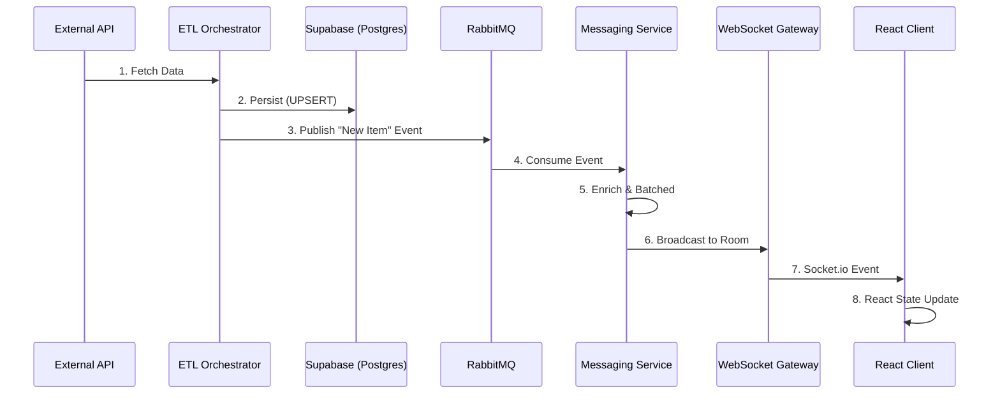

# Real-Time Data Architecture

> **Deep Dive: Streaming Intelligence Pipeline**
>
> This document details the end-to-end streaming architecture that powers ExoDuZe's "Live Feed" and real-time market updates. It covers the journey of a data point from external API to the user's screen in milliseconds.

---

## 1. Pipeline Overview

The ExoDuZe streaming pipeline is designed for **low latency**, **high throughput**, and **fault tolerance**. It processes over 100+ events per minute from 8 different categories, normalizing them into a unified stream.



---

## 2. Ingestion Layer (ETL)

### 2.1 Polling & Webhooks
*   **Polling**: High-frequency polling (every 1-5 mins) for critical sources like Crypto Prices, GDELT, and Breaking News.
*   **Webhooks**: Direct integration for immediate events (e.g., On-chain transaction alerts).

### 2.2 Normalization
Before data enters the stream, it is normalized into a `UnifiedItem` structure:
```typescript
interface UnifiedItem {
  id: string;
  type: 'market' | 'news' | 'signal' | 'sports';
  title: string;
  impact: 'critical' | 'high' | 'medium' | 'low';
  sentiment: 'bullish' | 'bearish' | 'neutral';
  // ... standardized metadata
}
```

### 2.3 Event Publishing
After persistence, the ETL Orchestrator publishes an event to RabbitMQ using a topic-based routing key:
*   `market.crypto.price_update`
*   `market.politics.election_alert`
*   `market.signals.trend_detected`

---

## 3. Streaming Layer (RabbitMQ & Socket.io)

### 3.1 RabbitMQ Topic Exchange
We use a **Topic Exchange** (`amq.topic`) to allow flexible subscriptions.

*   **Exchange**: `market_events`
*   **Routing Keys**: `category.type.severity`
    *   Example: `crypto.price.high` matches queues for "Crypto Dashboard" and "High Impact Alerts".

### 3.2 MarketMessagingService
This NestJS service acts as the bridge between the message queue and the WebSocket gateway.

*   **Responsibility**: Consumes RabbitMQ messages.
*   **Enrichment**: Adds computed fields (e.g., "Time since publish").
*   **Buffering**: Implements a 100ms debouncing buffer to coalesce rapid-fire updates (like price ticks) into single packets.

### 3.3 WebSocket Gateway (`MarketDataGateway`)
Built on **Socket.io**, handling thousands of concurrent connections.

*   **Rooms**: Clients join rooms based on current view:
    *   `room:global` (Top Markets)
    *   `room:crypto` (Crypto Dashboard)
    *   `room:market:{id}` (Specific Market Orderbook)
*   **Efficiency**: Custom binary serialization (MsgPack) can be enabled for high-frequency price feeds.

---

## 4. Frontend Integration

### 4.1 React Hook: `useMarketSocket`
A custom hook that manages the WebSocket lifecycle.

```typescript
const { lastMessage, isConnected } = useMarketSocket({
  channels: ['crypto', 'signals'],
  onMessage: (msg) => updateOrderBook(msg)
});
```
*   **Auto-Reconnect**: Exponential backoff reconnection strategy.
*   **Stale-While-Revalidate**: UI shows cached data while reconnecting.

### 4.2 Optimistic Updates
The UI performs optimistic updates for user actions (e.g., placing a bet) while waiting for the confirmed socket message to arrive, ensuring an "instant" feel.

### 4.3 Visual Feedback
*   **Flash Updates**: Price cells flash green/red upon change.
*   **Live Indicators**: "Live" badges pulse when connected.
*   **Toast Notifications**: Critical alerts (Impact > High) trigger toast notifications even if the user is on a different tab.

---

## 5. Security & Scalability

### 5.1 Security
*   **JWT Auth**: Socket handshake requires valid JWT.
*   **Rate Limiting**: Per-socket message quotas to prevent DOS.
*   **Read-Only**: Clients can only *subscribe* to data channels; they cannot publish to them.

### 5.2 Scalability
*   **Redis Adapter**: Socket.io uses Redis Pub/Sub to scale across multiple API instances/pods.
*   **Horizontal Scaling**: Stateless architecture allows adding more gateway nodes behind a load balancer.

---
