# Wallet Authentication System

> **Multi-Chain Identity & Non-Custodial Authentication**
> Version: 1.0.0 | Published: January 23, 2026
> Status: Production Ready

---

## 1. Overview

The DeJaVu Wallet Authentication System provides a secure, non-custodial login mechanism supporting multiple blockchain ecosystems (EVM, Solana, SUI). It acts as a unified identity layer allowing users to authenticate via cryptographic signatures without relying on passwords or traditional OAuth providers.

### Key Capabilities
- **Multi-Chain Support**: Ethereum (and L2s), Solana, and SUI.
- **Mobile-First**: Deep linking via **Reown AppKit (WalletConnect v5)**.
- **Security**: Challenge-Response (SIWE), Replay Protection (Nonces), and Domain Binding.
- **Unified Identity**: Link multiple wallets (desktop & mobile) to a single user profile.

---

## 2. Architecture

The system follows a stateless, challenge-response architecture compliant with EIP-4361 (Sign-In with Ethereum) and equivalent standards for Solana/Sui.

```mermaid
sequenceDiagram
    participant User
    participant Frontend
    participant AppKit
    participant API
    participant Database

    User->>Frontend: Select Wallet (e.g., MetaMask, WalletConnect)
    
    rect rgb(20, 20, 20)
        Note over Frontend: Connection Phase
        alt WalletConnect (Mobile)
            Frontend->>AppKit: open()
            AppKit->>User: Show QR / Deep Link
            User->>AppKit: Approve Connection
            AppKit-->>Frontend: Connected (Address)
        else Injected (Extension)
            Frontend->>User: Request Connection
            User-->>Frontend: Approve
        end
    end

    rect rgb(25, 25, 30)
        Note over Frontend: Challenge Phase
        Frontend->>API: POST /auth/wallet/challenge
        API->>Database: generate_wallet_nonce()
        Database-->>API: Nonce + SIWE Message
        API-->>Frontend: Challenge Message
    end

    rect rgb(30, 30, 35)
        Note over Frontend: Signing Phase
        Frontend->>User: Request Signature
        User-->>Frontend: Cryptographic Signature
        Frontend->>API: POST /auth/wallet/verify
    end

    rect rgb(35, 35, 40)
        Note over API: Verification Phase
        API->>Database: consume_wallet_nonce()
        Database-->>API: Valid / Invalid
        API->>API: Generate JWT
        API-->>Frontend: Access Token (Session)
    end
```

---

## 3. Frontend Implementation

### 3.1 Wallet Adapter Strategy
We utilize a **Strategy Pattern** to normalize interactions across disparate blockchain SDKs. The `WalletAdapter` interface standardizes `connect()`, `signMessage()`, and `getAddress()` methods.

**Source**: `apps/web/src/services/walletAdapters.ts`

| Provider | Implementation | Key Features |
|----------|----------------|--------------|
| **MetaMask** | `window.ethereum` (EIP-6963) | EIP-712 Signing, Chain Switching |
| **Phantom** | `window.solana` | Solana & Bitcoin support (future proof) |
| **Coinbase** | `window.coinbaseWalletExtension` | Smart Wallet support |
| **Slush (Sui)** | `@mysten/dapp-kit` | Native Move transaction signing |
| **WalletConnect** | **Reown AppKit v5** | Mobile Deep Linking, QR Scan, Multi-Chain |

### 3.2 Unified Reown & Mobile Strategy
We utilize **Reown AppKit** (formerly WalletConnect Web3Modal) as the backbone for our unified authentication strategy, ensuring seamless experience across platforms.

#### **Desktop Integration**
- **Primary Method**: Direct injection (EIP-6963) for installed wallets (Metamask, Phantom, etc.).
- **Fallback**: Reown AppKit modal for users wishing to scan QR codes with their mobile wallets.
- **UX Logic**: 
  - If a wallet is installed: Shows "Recommended" badge.
  - If not installed: Shows "Install" badge with direct download link (preventing dead clicks).

#### **Mobile Integration**
- **Architecture**: **Mobile-First Deep Linking**.
- **Behavior**: 
  - **Bypass Installation Checks**: On mobile browsers, "isInstalled" checks are bypassed to prevent false negatives.
  - **Deep Links**: Clicking "Metamask" or "Phantom" directly triggers the app via Universal Links (e.g., `metamask://`), upgrading the experience from a simple web view to a native app interaction.
  - **AppKit Fallback**: If specific wallet deep links fail, the Reown AppKit modal serves as a universal connector, handling deep links for hundreds of wallets automatically.

#### **Configuration**
- **Provider**: `AppKitProvider` wraps the application root.
- **Project ID**: Configured via `VITE_WALLETCONNECT_PROJECT_ID`.
- **Chains**: Support for Mainnet, Base, Solana, and SUI via their respective adapters standardizing the connection interface.

---

## 4. Backend Implementation

### 4.1 Challenge Generation
The backend generates a cryptographically random, single-use nonce via the database function `generate_wallet_nonce`.

**Security Features**:
- **Nonce Entropy**: 32 bytes random hex (pgcrypto).
- **Expiration**: Nonces expire after 5 minutes.
- **Domain Binding**: Message binds to `dejavu.app` to prevent phishing.
- **Format**: 
  - EVM: EIP-4361 (SIWE) standard.
  - SUI/Solana: Custom readable message formats.

### 4.2 Signature Verification
Verification is handled by specific services tailored to the chain's cryptography:
1. **EVM**: `ethers.verifyMessage` (Recovers address from ECDSA signature).
2. **Solana**: `nacl.sign.detached.verify` (Ed25519 signature verification).
3. **Sui**: `@mysten/sui.js/verify` (Handles Intent-based signatures).

---

## 5. Database Schema (Supabase)

### 5.1 Tables
Migration: `025_wallet_connect_auth.sql`

#### `wallet_auth_nonces`
Stores active challenges to enforce single-use.
| Column | Type | Purpose |
|--------|------|---------|
| `nonce` | TEXT | Unique session identifier |
| `status` | ENUM | `pending`, `used`, `expired` |
| `expires_at` | TIMESTAMPTZ | Automatic handling of stale requests |

#### `connected_wallets`
Links verified addresses to user profiles.
| Column | Type | Purpose |
|--------|------|---------|
| `user_id` | UUID | Link to `profiles` table |
| `address` | TEXT | Blockchain address |
| `chain` | TEXT | `ethereum`, `solana`, `sui` |
| `wallet_provider` | TEXT | Source of connection |

### 5.2 Key Functions

#### `check_wallet_auth_rate_limit()`
Prevents brute force attacks by limiting failed signature attempts.
- **Wallet Limit**: 5 failed attempts / 15 mins.
- **IP Limit**: 50 failed attempts / 15 mins.

#### `log_wallet_auth_attempt()`
Audits every authentication attempt (success or failure) with a risk score based on:
- Rapid consecutive attempts.
- Multiple wallets from single IP.
- Known bad actors (future expansion).

---

## 6. Security & Best Practices

1. **Replay Attack Prevention**:
   Every signature must include a nonce that exists in `wallet_auth_nonces` with `status='pending'`. Upon verification, the nonce is atomically marked `used` via `consume_wallet_nonce()`.

2. **User Existence Check**:
   The procedure `find_or_create_wallet_user()` automatically detects if an address corresponds to an existing user or requires a new account, streamlining the UX.

3. **Rate Limiting (Updated)**:
   Authentication endpoints have been upgraded to allow **50 requests/min** (up from 5) to accommodate the multi-step handshake process (Connect -> Challenge -> Verify) without false positives during heavy use.

---

## 7. Email Verification (Account Elevation)

Wallet-only users can optionally link and verify an email address to enhance account recovery options and receive notifications.

### 7.1 Flow
1.  **Request**: User enters email in **Settings -> Profile**.
2.  **API Call**: `POST /users/email/request-verification`
    *   Generates a 6-digit random code.
    *   Stores code in `profiles.preferences.email_verification` (JSONB).
    *   Sets expiration to 15 minutes.
3.  **Verification**: User enters code in UI prompt.
4.  **API Call**: `POST /users/email/verify`
    *   Validates code and expiration.
    *   Updates `profiles.email` column.
    *   Clears verification data.

### 7.2 Security Controls
- **Rate Limiting**: Max 5 failed attempts before the code is invalidated.
- **Isolation**: The `email` column is **only** updated after successful code verification.

